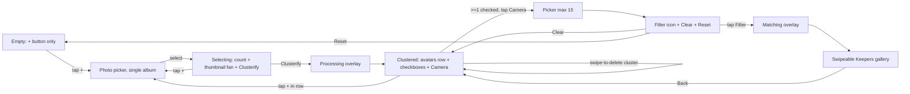

# FaceMesh — Unified Spec & Implementation Plan

> Note on naming: the source docs say "FaceMash" — every occurrence is treated as a typo for **FaceMesh**, including the package (`com.alifesoftware.facemesh`).

## 1. Foundational decisions (locked)

- **App name (display):** FaceMesh
- **Package:** `com.alifesoftware.facemesh`
- **Language:** Kotlin 2.x
- **UI:** Jetpack Compose + Material 3 (single-Activity, Navigation-Compose)
- **Build:** AGP 8.x, `compileSdk = 35`, `targetSdk = 35`, `minSdk = 29` (Android 10)
- **Inference runtime:** TFLite via Play Services (`tensorflow-lite-gpu-play-services` + `InterpreterApi`); GPU delegate with XNNPACK CPU fallback
- **Models (sidecar download, not bundled):** BlazeFace (~200 KB) + GhostFaceNet-V1 FP16 (~2.5 MB) + `config.json`
- **Algorithms:** Pure-Kotlin affine alignment, DBSCAN clustering, cosine similarity (dot product on L2-normalized vectors), threshold ≈ 0.80
- **Storage:** Room (clusters, per-face embeddings) + Preferences DataStore (UI/app state, thresholds)
- **Architecture:** MVVM + UseCase + Repository, `Coroutines`/`Flow`, `WorkManager` for batch inference
- **APK growth budget:** **< 500 KB** over the pre-feature baseline (R8 full mode, `shrinkResources`)

## 2. Deliverable: a single `SPEC.md`

I will create **one** consolidated spec at `[FaceMesh/SPEC.md](FaceMesh/SPEC.md)` (the only doc file we add up-front, per your rule on docs). Outline:

1. Product overview & goals
2. Business requirements (BR-01…05)
3. Functional requirements (FR-01…36) — merged + de-duped from both PRDs, all naming fixed to FaceMesh
4. UI / UX spec — Compose-first, including the 5 screen states (Empty, Selecting, Processing, Clustered, Filtering, Keepers) and component-level guidance
5. Technical architecture — module map, MVVM layers, threading model
6. Image-processing pipeline — Detect → Align → Embed → Cluster/Match (text walkthrough, no code)
7. Data model — Room entities + DataStore schema
8. Model delivery — sidecar download flow, integrity check, fallback
9. Dependencies + APK budget table
10. Non-functional requirements (privacy, perf, thermal, a11y)
11. Acceptance criteria (matches §3 FRs 1:1)
12. Open items / future work

## 3. Reconciled functional scope (the merged truth)

Key reconciliations vs. the source PRDs:
- Thumbnail fan = most-recent 3–4 photos **globally** (per your earlier answer to DeepSeek)
- **Swipe-to-delete** clusters with confirmation (per your earlier answer)
- Cluster naming = **deferred to v1.1** (future)
- Centroid auto-update during Filter = **off in v1**, optional confirm in v1.1
- DBSCAN noise faces = **silently ignored in v1** (will surface as "Unclassified" question in §12 of spec)
- Reset = always shows AlertDialog confirmation
- Photo Picker = Android 13+ `ACTION_PICK_IMAGES` (with `READ_MEDIA_IMAGES` only when needed); on API 29–32 use `ACTION_OPEN_DOCUMENT` / `getContent`

## 4. Module / package layout (proposed)

Single Gradle module `:app` to keep APK overhead minimal:

- `com.alifesoftware.facemesh.ui` — Compose screens (`HomeScreen`, `KeeperGalleryScreen`) + components (`ThumbnailFan`, `ClusterRow`, `CenterActionButton`, `TopActions`)
- `com.alifesoftware.facemesh.ui.theme` — Material 3 theme tokens
- `com.alifesoftware.facemesh.viewmodel` — `HomeViewModel` (single state machine), `KeeperViewModel`
- `com.alifesoftware.facemesh.domain` — UseCases: `ClusterifyUseCase`, `FilterAgainstClustersUseCase`, `DeleteClusterUseCase`, `ResetAppUseCase`
- `com.alifesoftware.facemesh.ml` — `TfLiteRuntime` (Play Services init + delegate selection), `FaceDetector` (BlazeFace), `FaceEmbedder` (GhostFaceNet), `FaceAligner` (Matrix.setPolyToPoly)
- `com.alifesoftware.facemesh.ml.cluster` — `DBSCAN`, `CosineSimilarity`, `EmbeddingMath`
- `com.alifesoftware.facemesh.ml.download` — `ModelDownloadManager` (WorkManager + integrity hash)
- `com.alifesoftware.facemesh.data` — Room (`AppDatabase`, `Cluster`, `ClusterImage`, `ClusterDao`), DataStore (`AppPreferences`)
- `com.alifesoftware.facemesh.media` — `ImageLoader` (downsampled bitmap decode with `inSampleSize`), `UriValidator`
- `com.alifesoftware.facemesh.di` — manual DI (no Hilt → save APK; light hand-rolled object graph)

## 5. Implementation phases

Each phase ends with a runnable build. Models and Room schema get versioned from day one.

- **Phase 0 — Project bootstrap:** Empty single-Activity Compose app at `com.alifesoftware.facemesh`, Material 3 theme, R8 full + resource shrinking, baseline APK size measurement.
- **Phase 1 — UI shell + state machine:** All 6 screen states wired to a `HomeViewModel` with mocked data (no ML). Thumbnail fan, cluster row, top actions, swipeable keeper gallery (`HorizontalPager`).
- **Phase 2 — Photo picker + persistence:** `ActivityResultContracts.PickMultipleVisualMedia`, single-album enforcement, in-memory selection, Room + DataStore.
- **Phase 3 — TFLite runtime + model download:** Play Services TFLite init, GPU/CPU delegate negotiation, `ModelDownloadManager` (sidecar ZIP + SHA-256), progress UI on first Clusterify.
- **Phase 4 — Detection + alignment:** BlazeFace inference, confidence + size-outlier filtering, 6-landmark affine alignment to 112×112 via `Matrix.setPolyToPoly`.
- **Phase 5 — Embedding + clustering:** GhostFaceNet inference, L2-normalize, custom DBSCAN, centroid computation, persist to Room.
- **Phase 6 — Filter pipeline:** ≤15 image picker enforcement, per-face cosine match against checked centroids, "Keeper" decision, gallery hand-off.
- **Phase 7 — Polish:** Swipe-to-delete cluster + confirmation, Reset confirmation dialog, animations (fan rotation, camera↔filter morph), haptics, a11y `contentDescription` pass, edge-case messages.
- **Phase 8 — Hardening:** APK size verification (<500 KB delta), thermal/throttling test on mid-range device, OOM guards, unit tests for DBSCAN + cosine + alignment, instrumentation tests for state machine.

## 6. Items I still need from you (before/after spec is approved)

- **Model hosting URL** for the sidecar ZIP (`blazeface.tflite` + `ghostfacenet_v1_fp16.tflite` + `config.json`) — blocks Phase 3.
- **Brand colors / app icon** — DeepSeek proposed Primary `#1565C0`, Accent `#FF6F00`. Confirm or replace.
- **DBSCAN noise faces** — show as an "Unclassified" cluster, or silently drop in v1?
- **Keeper output** — in-app gallery only, or also save to a `Pictures/FaceMesh/Keepers` MediaStore folder?

I'll capture these as "Open Questions" in `SPEC.md §12` so we can resolve them as we hit each phase rather than blocking the spec.