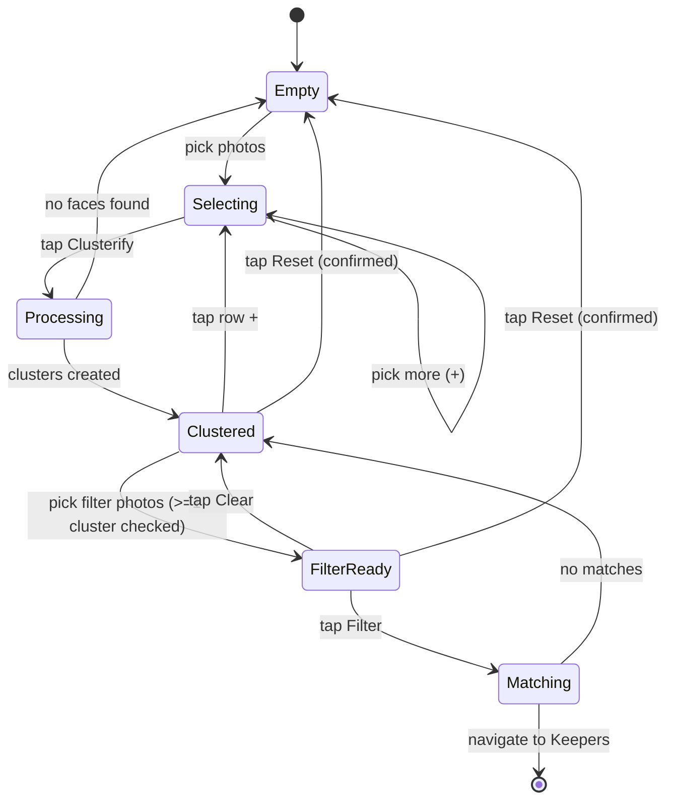
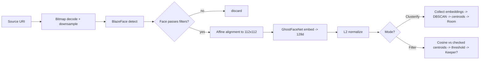

# FaceMesh — Product & Technical Specification

| Field    | Value                                                       |
|----------|-------------------------------------------------------------|
| App      | **FaceMesh**                                                |
| Package  | `com.alifesoftware.facemesh`                                |
| Platform | Native Android (Kotlin 2.x, Jetpack Compose + Material 3)   |
| minSdk   | 29 (Android 10)                                             |
| target / compileSdk | 35                                               |
| Version  | 1.0                                                         |
| Status   | Draft — locked baseline                                     |

> **Naming note:** every "FaceMash" reference in upstream source documents (DeepSeek PRD, Qwen PRD, Gemini deep-dive) is treated as a typo for **FaceMesh**, including the package name (`com.alifesoftware.facemesh`).

---

## Table of contents

1. [Product overview & goals](#1-product-overview--goals)
2. [Business requirements](#2-business-requirements)
3. [Functional requirements](#3-functional-requirements)
4. [UI / UX specification](#4-ui--ux-specification)
5. [Technical architecture](#5-technical-architecture)
6. [Image-processing pipeline](#6-image-processing-pipeline)
7. [Data model](#7-data-model)
8. [Model delivery (sidecar download)](#8-model-delivery-sidecar-download)
9. [Dependencies & APK budget](#9-dependencies--apk-budget)
10. [Non-functional requirements](#10-non-functional-requirements)
11. [Acceptance criteria](#11-acceptance-criteria)
12. [Open items / future work](#12-open-items--future-work)

---

## 1. Product overview & goals

FaceMesh is a **100% on-device** Android app that helps a user organize and filter personal photos by the **people in them**, without any cloud dependency.

It supports two core flows:

1. **Discovery / Clustering** — point the app at a batch of photos; it finds every face, generates a 512-dimensional embedding per face (GhostFaceNet-V1), and groups them by identity using DBSCAN. Each group ("cluster") is rendered as a circular avatar.
2. **Filtering / Matching** — pick up to 15 new photos and a subset of saved clusters; the app keeps only the photos that contain at least one face matching one of the chosen clusters ("Keepers").

### Goals

- **Privacy-first:** no face image, embedding, or URI ever leaves the device.
- **Snappy:** sub-1.5s per face inference on mid-range hardware; full Filter run on 15 photos in < 2s steady-state.
- **Tiny footprint:** APK growth attributed to face-recognition logic must stay **< 500 KB** over a baseline empty Compose app. ML models are **never bundled**; they download as sidecars on first use.
- **Compose-native:** state-driven Material 3 UI, single-Activity, minimal animations that feel intentional.
- **Resilient:** graceful GPU → CPU fallback, retry-able model download, OOM-safe bitmap handling.

### Non-goals (v1)

- No cloud sync, no account system, no telemetry.
- No live camera capture (gallery picker only).
- No cluster naming UI (deferred to v1.1).
- No automatic centroid update during Filter (deferred to v1.1, opt-in confirm mode).
- No cluster merging UI for two clusters that are actually the same person (out of scope).

---

## 2. Business requirements

| ID    | Requirement                                                                                                              |
|-------|--------------------------------------------------------------------------------------------------------------------------|
| BR-01 | All face clustering and matching run on-device. Zero backend dependency for face data.                                   |
| BR-02 | APK size growth attributable to face-processing logic must not exceed **500 KB** over the empty-app baseline.            |
| BR-03 | Detector and recognizer models are **downloaded** after install (sidecar) and stored privately; they are not in the APK. |
| BR-04 | Inference uses the **TFLite GPU delegate via Play Services**; an XNNPACK CPU fallback is allowed.                        |
| BR-05 | UI is clean, self-explanatory, and works equally well on flagship and mid-range Android 10+ devices.                     |
| BR-06 | The app must function entirely offline once the model bundle has been downloaded once.                                   |

---

## 3. Functional requirements

### 3.1 Initial state (empty)

| ID    | Requirement                                                                                                       |
|-------|-------------------------------------------------------------------------------------------------------------------|
| FR-01 | On first launch, the home screen shows the title **"FaceMesh"** and a prominent circular **"+"** in the center.    |
| FR-02 | No other UI elements (clusters, photos, action bar) are visible until the user adds photos or completes Clusterify. |

### 3.2 Adding photos for clustering

| ID    | Requirement                                                                                                                  |
|-------|------------------------------------------------------------------------------------------------------------------------------|
| FR-03 | Tapping the **"+"** opens the system photo picker.                                                                            |
| FR-04 | Per pick session, the user can only choose from a single folder/album. To add photos from another album they tap **"+"** again. |
| FR-05 | While selecting, a counter "**N photos selected**" updates in real time after each picker session.                            |
| FR-06 | A "fan" of the **last 3–4 selected thumbnails** appears stacked behind the **"+"**, each rotated slightly (≈ ±8°).             |
| FR-07 | The thumbnail fan reflects the most-recent 3–4 selected photos **globally** (not per folder).                                  |
| FR-08 | A primary **"Clusterify"** button appears at the bottom as soon as at least one photo has been selected.                       |

### 3.3 Clustering phase

| ID    | Requirement                                                                                                                                                              |
|-------|--------------------------------------------------------------------------------------------------------------------------------------------------------------------------|
| FR-09 | Tapping **Clusterify** triggers: detect → align → embed → DBSCAN → centroid computation → persist clusters.                                                                |
| FR-10 | Models (BlazeFace + GhostFaceNet) are downloaded on first use if not present (see §8).                                                                                     |
| FR-11 | During processing, a translucent overlay shows an indeterminate progress indicator + "Processing N of M" text; all interactive elements are disabled.                       |
| FR-12 | If no face is detected in any image, the app shows "No faces found" (Snackbar) and returns to the empty state.                                                              |
| FR-13 | Each cluster is persisted with: unique `id`, `centroid` (512 floats), `representativeImageUri`, `faceCount`, `createdAt`. Each contributing face is persisted as a row in `cluster_image` keyed by source image URI + cluster id, including the original embedding. |

### 3.4 Post-clustering UI

| ID    | Requirement                                                                                                                                  |
|-------|----------------------------------------------------------------------------------------------------------------------------------------------|
| FR-14 | After clustering succeeds, the center **"+"** is replaced by a **"Camera"** action button (disabled by default until a cluster is checked).   |
| FR-15 | A horizontally scrollable row of **cluster avatars** appears at the bottom of the screen.                                                     |
| FR-16 | Each avatar is a circular crop of the cluster's representative face.                                                                           |
| FR-17 | A **checkbox** sits at the top-left of each avatar; tapping toggles selection.                                                                 |
| FR-18 | The last item in the row is a circular **"+"** that returns the user to the photo-add flow (FR-03).                                            |
| FR-19 | The center **Camera** is enabled iff **≥ 1** cluster is checked. Toggling all off re-disables it immediately.                                 |
| FR-20 | A horizontal swipe on a cluster avatar reveals a destructive **Delete** affordance; deletion requires AlertDialog confirmation and cascades.   |

### 3.5 Filtering phase

| ID    | Requirement                                                                                                                                                  |
|-------|--------------------------------------------------------------------------------------------------------------------------------------------------------------|
| FR-21 | Tapping the enabled **Camera** opens the photo picker limited to **at most 15 images** (enforced via `PickMultipleVisualMedia(maxItems = 15)`).               |
| FR-22 | Once filter images are selected, the **Camera** icon morphs into a **Filter (funnel)** icon.                                                                   |
| FR-23 | A **Clear** button appears top-right (only while filter images exist); pressing Clear discards filter selection, reverts Filter→Camera (disabled if no clusters checked), and leaves clusters intact. |
| FR-24 | A **Reset** button is always visible top-right; pressing Reset shows an AlertDialog and, on confirm, wipes all clusters + filter selection + DataStore state, returning to FR-01. |
| FR-25 | Tapping **Filter** runs each face in each selected image against the centroids of currently **checked** clusters only.                                          |
| FR-26 | An image is a **Keeper** iff at least one face in it has cosine similarity ≥ `threshold` (default 0.65 for the 512-d GhostFaceNet, override-able via downloaded `manifest.json`) with at least one checked cluster's centroid.           |
| FR-27 | Non-matching images are silently discarded (not persisted).                                                                                                     |
| FR-28 | After processing, the app navigates to a full-screen **swipeable gallery** (`HorizontalPager`) of Keepers with an optional indicator and back action.            |
| FR-29 | Back from the gallery returns to the Clustered state with the same cluster checkboxes preserved.                                                                |

### 3.6 Edge cases

| ID    | Scenario                                            | Behavior                                                                                                  |
|-------|-----------------------------------------------------|-----------------------------------------------------------------------------------------------------------|
| FR-30 | Model download fails or times out                   | Retry with exponential backoff (3 attempts); on persistent failure show a Snackbar with manual retry.       |
| FR-31 | GPU delegate unavailable                            | Fall back to XNNPACK CPU; surface a one-time tooltip indicating slightly longer processing.                |
| FR-32 | User attempts > 15 filter images                    | Picker enforces the cap; if device returns more (legacy picker), trim to 15 and toast the user.            |
| FR-33 | No matches found during filtering                   | Snackbar "No matches found"; return to Clustered without navigating to gallery.                            |
| FR-34 | All clusters un-checked while in Filter-ready state | Camera/Filter button disables; tapping the disabled state is a no-op with a subtle haptic.                  |
| FR-35 | Very large originals (e.g. 48 MP)                   | Down-sample with `inSampleSize` so the largest dimension ≤ 1280 px before detection.                       |
| FR-36 | Last cluster deleted via swipe                      | Cluster row disappears; center icon reverts to **"+"** (empty state behavior).                             |
| FR-37 | Permission denied for `READ_MEDIA_IMAGES` (API 33+) | Show rationale; if denied twice, route the user to system settings with a deep link.                       |
| FR-38 | Process death / config change during processing     | Pipeline runs via `WorkManager` (long jobs) or `viewModelScope` (short ones); progress survives rotation.   |

---

## 4. UI / UX specification

### 4.1 Screen inventory

The app is a **single Activity** hosting a `NavHost` with two destinations:

- `home` — the state machine (all states 4.2.1 – 4.2.5)
- `keepers/{sessionId}` — full-screen Keeper gallery

### 4.2 Home screen states



#### 4.2.1 Empty
- Centered title "FaceMesh" (Display Medium).
- Centered circular `FloatingActionButton` "+" (`FilledIconButton`, 72.dp, accent surface).
- Subtle radial gradient background.

#### 4.2.2 Selecting
- "**N photos selected**" text above the "+" (Body Medium, secondary color).
- A `ThumbnailFan` composable (custom layout) renders the last 3–4 thumbnails behind the "+", offset by `(±8.dp, ±4.dp)` and rotated `(±8°)`. Animates on add.
- A full-width primary **Clusterify** button at the bottom, rounded 16.dp, hauling its own loading state.
- Top-right **Reset** is hidden until clusters exist.

#### 4.2.3 Processing
- Translucent scrim over current state.
- Centered indeterminate `CircularProgressIndicator` (large) + "Processing X / Y" caption.
- Optional `Cancel` text button cancels the underlying coroutine/WorkRequest.

#### 4.2.4 Clustered
- Center: `CameraButton` (custom IconToggleButton). Disabled = grey filled tonal; enabled = primary container.
- Bottom: horizontal `LazyRow` of `ClusterAvatar`s (64.dp circular) each with a top-left `Checkbox` overlay; trailing `+` avatar.
- Top-right: `Reset` (text button). `Clear` is hidden in this state.
- Swipe-to-delete: `SwipeToDismissBox` per avatar, end-to-start direction, reveals red Delete with confirmation.

#### 4.2.5 FilterReady
- Center icon morphs Camera → Filter (funnel) using `AnimatedContent`.
- Top-right shows both **Clear** and **Reset** buttons.
- Bottom of screen shows a horizontal carousel of the **selected filter image thumbnails** (separate from cluster row; cluster row stays visible above it).

#### 4.2.6 Matching (overlay)
Identical to Processing but caption reads "Filtering X / Y images" and Cancel returns to Clustered.

### 4.3 Keeper gallery screen
- Full-screen `HorizontalPager` over Keeper URIs with `PageIndicator` dots beneath (only if > 1).
- Top app bar: back arrow on left, optional `Share` action on right (deferred to v1.1).
- Each page renders the image with `ContentScale.Fit`, dark scrim background.

### 4.4 Visual design

The app uses an **always-dark "All Black" OLED palette** (OQ-2 resolution). System day/night setting is intentionally ignored.

Material You dynamic color is **off by default** (the brand palette wins on every device), but the user can opt in via **Settings → Appearance → Use system wallpaper colors**. When toggled on (Android 12+ only — older devices show a disabled control with an explanatory subtitle), `dynamicDarkColorScheme(LocalContext.current)` replaces the All Black scheme and re-renders the entire UI live. Persisted via `AppPreferences.dynamicColorEnabled`.

| Material 3 role     | Token              | Hex        | Notes                                                            |
|---------------------|--------------------|------------|------------------------------------------------------------------|
| `primary`           | `FaceMeshPrimary`  | `#007AFF`  | iOS-style blue (Clusterify, Filter, enabled center button)        |
| `secondary`         | `FaceMeshSecondary`| `#10B981`  | Emerald (cluster checkbox checked state, success affordances)     |
| `tertiary`          | `FaceMeshSuccess`  | `#32D74B`  | Reserved for v1.1 success animations                              |
| `background`/`surface` | `FaceMeshBackground` | `#000000` | Pure OLED black                                                |
| `surfaceVariant`    | `FaceMeshSurfaceVariant` | `#1C1C1E` | Slight elevation tint for grouped controls (disabled center button, AddMore avatar) |
| `outline`           | `FaceMeshOutline`  | `#3A3A3C`  | Subtle stroke for unchecked checkboxes / dividers                 |
| `outlineVariant`    | `FaceMeshElevation`| `#232A34`  | Range-selector-style elevated background                          |
| `onSurface`         | `FaceMeshOnSurface`| `#F2F2F2`  | Primary text                                                      |
| `onSurfaceVariant`  | `FaceMeshOnSurfaceMuted` | `#A0A0A0` | Subtext                                                       |
| `error` / `errorContainer` | `FaceMeshNegative` | `#FF453A` | Reset / Delete / Notification                              |
| `scrim`             | `FaceMeshOverlayScrim` | `#000000` @ 60% | Processing & Matching modal overlay                       |
| Launcher icon background | (XML resource) | `#007AFF`  | Adaptive icon background (so the mark stands out on the home screen) |

Typography:

| Use                | Spec                  |
|--------------------|-----------------------|
| Display title      | 24 sp, weight 700     |
| Body               | 14 sp, weight 400     |
| Touch targets      | ≥ 48.dp               |
| Corner radius      | 16.dp on bottom buttons, 50% on circulars |

System bars: forced light icons (`SystemBarStyle.dark`) on transparent background so they always read against the black surface, regardless of the device's system day/night setting.

### 4.5 Motion & micro-interactions
- **Fan add:** new thumbnail enters with `scaleIn(0.8f → 1f) + fadeIn`, then settles to its rotated offset (220 ms, `FastOutSlowInEasing`).
- **Camera ↔ Filter morph:** `AnimatedContent` with `fadeIn + scaleIn` / `fadeOut + scaleOut` (180 ms).
- **Cluster checkbox:** color tween + light haptic on toggle.
- **Reset / Delete:** AlertDialog with destructive (red) confirm.

### 4.6 Accessibility
- Every icon-only control has a `contentDescription`.
- Cluster avatars are described as "Cluster N of M, contains K photos" until naming lands.
- TalkBack focus order: top-bar → center action → cluster row → bottom button.
- Dynamic font scaling honored up to 200%.
- Color contrast meets WCAG AA against both surfaces.

### 4.7 Layout sketch (low-fi)

```
┌─────────────────────── FaceMesh ───────────────────────┐
│                                              [Clear] [Reset] │
│                                                              │
│                       ┌──────────┐                            │
│           thumb fan   │   + or   │   thumb fan               │
│             ╲╲╲       │ Camera / │       ╱╱╱                 │
│                       │  Filter  │                            │
│                       └──────────┘                            │
│                                                              │
│                  N photos selected                           │
│                                                              │
│  ◀ [☐ ◯]  [☑ ◯]  [☐ ◯]  …  [+] ▶            (cluster row)  │
│                                                              │
│  ┌───────────── Clusterify / Filter ─────────────┐           │
│  └────────────────────────────────────────────────┘           │
└───────────────────────────────────────────────────────────────┘
```

---

## 5. Technical architecture

### 5.1 Single Gradle module, layered packages

A single `:app` module keeps the dex / install delta minimal. Layers are enforced by package boundaries (Detekt/lint rule in Phase 8):

```
com.alifesoftware.facemesh
├── ui                  // Compose screens + components (no Android framework leaks)
│   └── theme           // Material 3 color/type/shape tokens
├── viewmodel           // HomeViewModel, KeeperViewModel (state-machine VMs)
├── domain              // Pure-Kotlin UseCases (no Android imports beyond Uri)
│   ├── ClusterifyUseCase
│   ├── FilterAgainstClustersUseCase
│   ├── DeleteClusterUseCase
│   └── ResetAppUseCase
├── ml                  // TFLite plumbing, detection, embedding, alignment
│   ├── TfLiteRuntime
│   ├── FaceDetector       (BlazeFace)
│   ├── FaceAligner        (Matrix.setPolyToPoly)
│   ├── FaceEmbedder       (GhostFaceNet)
│   ├── cluster
│   │   ├── DBSCAN
│   │   ├── CosineSimilarity
│   │   └── EmbeddingMath
│   └── download
│       └── ModelDownloadManager
├── data                // Persistence
│   ├── AppDatabase, ClusterDao, Cluster, ClusterImage
│   └── AppPreferences  (DataStore)
├── media               // ImageLoader (downsample), UriValidator
└── di                  // Hand-rolled object graph (no Hilt/Koin → save APK)
```

### 5.2 Threading model

| Workload                          | Dispatcher / runner                |
|-----------------------------------|------------------------------------|
| UI / Compose state                | `Dispatchers.Main.immediate`       |
| Bitmap decode + scaling           | `Dispatchers.IO`                   |
| TFLite inference (det + embed)    | dedicated single-thread executor (`Dispatchers.Default.limitedParallelism(1)`) — GPU delegate is single-context |
| DBSCAN / cosine math              | `Dispatchers.Default`              |
| Long-running Clusterify (≥ 30 imgs)| `WorkManager` `OneTimeWorkRequest` so progress survives process death |
| Model download                    | `WorkManager` with `Constraints.NetworkType.UNMETERED` (overridable) |

### 5.3 State machine (HomeViewModel)

A single `MutableStateFlow<HomeUiState>` is the source of truth. `HomeUiState` is a sealed interface with one case per §4.2 state. The VM reduces user intents (`HomeIntent`) into transitions; ML side-effects emit `HomeIntent.PipelineEvent` back into the reducer.

### 5.4 Error model

All ML and IO operations return `kotlin.Result<T>` (or a typed `FaceMeshError` sealed hierarchy at the domain boundary). The VM converts errors to user-facing messages via a `UiMessage` sealed type the UI collects.

### 5.5 No `Hilt` / no `Koin`

To preserve the 500 KB budget we use a small hand-rolled `AppContainer` constructed in `Application.onCreate()`. It exposes singletons for `AppDatabase`, `AppPreferences`, `ModelDownloadManager`, `TfLiteRuntime`, and use-case factories.

---

## 6. Image-processing pipeline

> Phase 1 = Discovery (Clusterify). Phase 2 = Matching (Filter). Both share Steps 1–3.



### 6.1 Step 1 — Decode & downsample
- Use `BitmapFactory.Options` with `inSampleSize` so the largest dimension is ≤ 1280 px.
- EXIF rotation honored via `ExifInterface` before further processing.

### 6.2 Step 2 — Detection (BlazeFace)
- Input: 128×128 RGB tensor (front-facing model variant).
- Output: bounding boxes + 6 landmarks (right/left eye, nose tip, mouth, right/left ear tragion) + score.
- Filters applied:
  - `score ≥ 0.75`.
  - Geometric sanity: eye-to-eye distance vs box width ratio in `[0.25, 0.65]`.
  - Size-outlier: if multiple faces, drop those with width > 2σ from the median width.

### 6.3 Step 3 — Alignment
- Build an `android.graphics.Matrix` via `setPolyToPoly` from the 4 source landmarks `{leftEye, rightEye, nose, mouthCenter}` to canonical 112×112 coordinates `{(38.3,51.7), (73.5,51.5), (56.0,71.7), (56.0,92.4)}` (ArcFace canonical, simplified to 4 points which is the limit of `setPolyToPoly`).
- Apply the matrix to a 112×112 `Canvas` to produce the aligned crop.
- Normalize pixel values per the model card (typically `(px / 127.5) - 1.0`).

### 6.4 Step 4 — Embedding (GhostFaceNet-V1 FP16)
- Input: 112×112×3 normalized.
- Output: 512-d float vector (NHWC layout, confirmed against the FP32 ONNX reference).
- L2-normalize so subsequent cosine similarity reduces to a dot product.

### 6.5 Step 5a — Clustering (Clusterify only)
- Algorithm: **DBSCAN** with cosine distance.
- Default params (overridable from config.json in §8): `eps = 0.5` (cosine distance — two unit embeddings are neighbours when `1 - dot(a,b) ≤ eps`, i.e. cosine similarity ≥ `1 - eps` = ≥ 0.5 at default), `minPts = 2`.
- Each cluster's centroid is the mean of its members' embeddings, then re-L2-normalized.
- Noise points (DBSCAN label -1) are silently ignored in v1 (open question §12).

### 6.6 Step 5b — Matching (Filter only)
- For each face in each filter image, compute `dot(embedding, centroid)` for every **checked** cluster centroid.
- Decision: image is a Keeper iff `max(similarity) ≥ 0.65` for GhostFaceNet-V1 512-d. (Originally specced as 0.80 for 128-d MobileFaceNet; the looser default reflects the higher-dimensional GhostFaceNet output. To be calibrated empirically and overridden via the downloaded `manifest.json`.)
- Early exit: once any face matches, the image is a Keeper, but the loop still finishes processing the image's faces if a future "auto-confirm to centroid" mode wants the data.

### 6.7 Performance targets
- Decode + detect + embed per face: ≤ 1500 ms median on Pixel 6a (mid-range GPU).
- 15-image filter end-to-end: ≤ 2000 ms steady-state (after warm-up).
- 50-image Clusterify: ≤ 30 s end-to-end on mid-range; under 15 s on flagship.

---

## 7. Data model

### 7.1 Room entities

```kotlin
@Entity(tableName = "cluster")
data class Cluster(
    @PrimaryKey val id: String,                   // UUID
    val centroid: ByteArray,                      // 512 floats serialized little-endian
    val representativeImageUri: String,
    val faceCount: Int,
    val createdAt: Long,
    val name: String? = null                      // reserved for v1.1
)

@Entity(
    tableName = "cluster_image",
    primaryKeys = ["clusterId", "imageUri", "faceIndex"],
    foreignKeys = [ForeignKey(
        entity = Cluster::class,
        parentColumns = ["id"],
        childColumns = ["clusterId"],
        onDelete = ForeignKey.CASCADE
    )],
    indices = [Index("clusterId")]
)
data class ClusterImage(
    val clusterId: String,
    val imageUri: String,
    val faceIndex: Int,                           // disambiguates multi-face images
    val embedding: ByteArray                      // 512 floats serialized
)
```

`FloatArray` ↔ `ByteArray` conversion uses a single `TypeConverter` (`ByteBuffer.wrap(...).order(ByteOrder.LITTLE_ENDIAN).asFloatBuffer()`).

### 7.2 DAO surface

```kotlin
@Dao
interface ClusterDao {
    @Query("SELECT * FROM cluster ORDER BY createdAt ASC") fun observeClusters(): Flow<List<Cluster>>
    @Query("SELECT * FROM cluster") suspend fun getAllClusters(): List<Cluster>
    @Insert suspend fun insertCluster(cluster: Cluster)
    @Insert suspend fun insertClusterImages(images: List<ClusterImage>)
    @Query("DELETE FROM cluster WHERE id = :id") suspend fun deleteCluster(id: String)
    @Query("DELETE FROM cluster") suspend fun deleteAll()
}
```

### 7.3 Preferences (DataStore)

| Key                      | Type    | Default | Purpose                                                |
|--------------------------|---------|---------|--------------------------------------------------------|
| `dbscan_eps`             | Float   | 0.5     | Allow tuning from downloaded `config.json`             |
| `dbscan_min_pts`         | Int     | 2       | Same                                                   |
| `match_threshold`        | Float   | 0.65    | Filter cosine similarity threshold (GhostFaceNet-V1 512-d) |
| `models_version`         | Int     | 0       | Currently installed sidecar bundle version             |
| `last_models_check`      | Long    | 0       | Epoch ms of last successful manifest check             |
| `pending_filter_session` | String? | null    | UUID for in-flight filter session (rotation safety)    |

### 7.4 Files on disk

- `filesDir/models/blazeface.tflite`
- `filesDir/models/ghostfacenet_v1_fp16.tflite`
- `filesDir/models/config.json`
- `filesDir/models/manifest.json` (downloaded payload contents + hashes for integrity)
- Source photos are **never copied**; we keep only `content://` URIs in Room.

---

## 8. Model delivery (sidecar download)

### 8.1 Manifest

Hosted at `<MODEL_BASE_URL>/manifest.json` (URL TBD — see §12):

```json
{
  "version": 1,
  "models": [
    {
      "type": "detector_blazeface_short_range",
      "name": "face_detection_short_range.tflite",
      "url": "face_detection_short_range.tflite",
      "sha256": "..."
    },
    {
      "type": "embedder_ghostfacenet_fp16",
      "name": "ghostface_fp16.tflite",
      "url": "ghostface_fp16.tflite",
      "sha256": "..."
    }
  ],
  "config": {
    "dbscan_eps": 0.5,
    "dbscan_min_pts": 2,
    "match_threshold": 0.65,
    "detector_input": [128, 128],
    "embedder_input": [112, 112]
  }
}
```

The `type` field is the stable lookup key used by `MlPipelineProvider`; `name` is the on-disk filename and `url` is relative to `BuildConfig.MODEL_BASE_URL`. `name` and `url` may freely change as long as `type` stays stable.

### 8.2 Download flow

1. On first **Clusterify** tap, `ModelDownloadManager` checks `filesDir/models/manifest.json`.
2. If missing or version-mismatched, enqueue a `OneTimeWorkRequest`:
   - Fetch `manifest.json`.
   - For each model file, download to a temp file, verify SHA-256, then atomic-rename into `filesDir/models/`.
   - Persist `models_version` and `last_models_check` to DataStore.
3. UI shows a determinate progress bar inside the Processing overlay.
4. Failure: 3-attempt exponential backoff (1s, 4s, 16s); on final failure, Snackbar with retry action.

### 8.3 Runtime delegate selection

```kotlin
val gpuOptions = TfLiteGpu.isGpuDelegateAvailable(ctx)
TfLiteRuntime.initialize(
    useGpu = gpuOptions.await(),
    fallback = Delegate.XNNPACK
)
```

A one-time toast — "Using CPU acceleration" — surfaces only when GPU is unavailable, then never again.

---

## 9. Dependencies & APK budget

### 9.1 Library matrix (target dex deltas after R8 full mode)

| Purpose             | Library                                                                              | Delta (rough) |
|---------------------|--------------------------------------------------------------------------------------|---------------|
| TFLite GPU runtime  | `com.google.android.gms:play-services-tflite-gpu` + `play-services-tflite-java`      | ~0 KB (Play Services side-loaded) |
| Compose BOM + UI    | `androidx.compose:compose-bom`, `material3`, `ui`, `foundation`                      | budgeted in baseline |
| Activity / Lifecycle| `androidx.activity:activity-compose`, `lifecycle-viewmodel-compose`, `lifecycle-runtime-ktx` | budgeted in baseline |
| Navigation          | `androidx.navigation:navigation-compose`                                             | ~30 KB |
| Coroutines          | `org.jetbrains.kotlinx:kotlinx-coroutines-android`                                   | ~50 KB |
| Room                | `androidx.room:room-runtime`, `room-ktx`, `room-compiler` (KSP)                      | ~110 KB |
| DataStore           | `androidx.datastore:datastore-preferences`                                           | ~25 KB |
| WorkManager         | `androidx.work:work-runtime-ktx`                                                     | ~80 KB |
| Image loading (avatars only) | `io.coil-kt:coil-compose` *(optional — see note)*                            | ~120 KB |
| Math / clustering   | hand-rolled                                                                          | ~5 KB  |

**Note on Coil:** if even Coil pushes us over budget, fall back to a tiny in-house thumbnail loader that uses `BitmapFactory` + an LRU cache. Decision is made empirically in Phase 8 based on the actual measured delta.

### 9.2 R8 / shrink config

- `minifyEnabled true`
- `shrinkResources true`
- `isCoreLibraryDesugaringEnabled false` (not needed at minSdk 29)
- Keep rules limited to: Room generated DAOs, TFLite Play Services entrypoints, Compose-related serialization (none), our `data class` entities used by Room.
- `proguard-android-optimize.txt` + `proguard-rules.pro`.

### 9.3 Manifest / permissions

- `READ_MEDIA_IMAGES` (API 33+, `maxSdkVersion`-gated for older paths)
- `INTERNET` (model download only)
- `ACCESS_NETWORK_STATE` (to gate model download)
- No `READ_EXTERNAL_STORAGE` declared.

---

## 10. Non-functional requirements

| ID     | Requirement                                                                                                          |
|--------|----------------------------------------------------------------------------------------------------------------------|
| NFR-01 | **Privacy:** no embedding or face image leaves the device. Network is used only to fetch the model bundle / manifest. |
| NFR-02 | **Resilience:** GPU → CPU fallback is automatic. Download retries with exponential backoff.                           |
| NFR-03 | **Performance:** main thread frame time stays < 16 ms during processing (UI runs on Main; ML on background pool).      |
| NFR-04 | **Memory:** peak heap ≤ 256 MB on a device with 6 GB RAM during Clusterify of 50 images.                              |
| NFR-05 | **Storage:** post-install footprint (excluding user photos) ≤ 20 MB (APK + models + Room).                            |
| NFR-06 | **Thermal:** inference loop yields between images (`yield()`); detect thermal throttling state and pause if `THROTTLING_SEVERE`. |
| NFR-07 | **Offline:** all functionality available offline once the model bundle has been downloaded.                            |
| NFR-08 | **Accessibility:** TalkBack support, contentDescriptions, dynamic font scaling to 200%, WCAG AA contrast.              |
| NFR-09 | **Stability:** no crash in the first 60 minutes of fuzz / monkey testing.                                              |
| NFR-10 | **APK growth:** verified < 500 KB delta over the empty-app baseline as part of Phase 8.                                 |

---

## 11. Acceptance criteria

Each criterion maps directly to one or more functional requirements.

1. **Empty state (FR-01, FR-02):** fresh install → only "FaceMesh" + "+" visible.
2. **Add photos (FR-03..08):** tap "+" → pick photos → "N photos selected" + thumbnail fan + Clusterify visible.
3. **Clusterify (FR-09..13):** tap Clusterify → progress overlay → cluster row populated; "+" replaced by disabled Camera.
4. **Cluster selection (FR-19):** tick a cluster → Camera enabled; untick all → Camera disabled.
5. **Swipe-to-delete (FR-20, FR-36):** swipe a cluster → confirm → cluster removed; deleting last cluster reverts to empty state.
6. **Filter pick (FR-21..23):** tap Camera → pick ≤ 15 images → Camera becomes Filter; Clear visible.
7. **Filter run (FR-25..28):** tap Filter → Matching overlay → swipeable Keeper gallery shown.
8. **No matches (FR-33):** Filter run with no matches → Snackbar; remain in Clustered.
9. **Clear (FR-23):** Clear discards filter selection but preserves clusters and selection.
10. **Reset (FR-24):** Reset → AlertDialog → confirm → empty state.
11. **Model download (FR-10, §8):** first Clusterify on a clean install fetches the bundle with progress; subsequent runs use cache.
12. **GPU fallback (FR-31):** force-disable GPU → app still works; one-time toast appears.
13. **Permission denied (FR-37):** deny `READ_MEDIA_IMAGES` twice → rationale + settings deep link surface.
14. **Rotation during processing (FR-38):** rotate device mid-Clusterify → progress and final state survive.
15. **APK budget (NFR-10):** measured `release` APK delta < 500 KB vs. Phase 0 baseline.

---

## 12. Open items / future work

### Open (resolution required during build, not blocking spec sign-off)

| #   | Item                                | Resolution path                                                                                  |
|-----|-------------------------------------|--------------------------------------------------------------------------------------------------|
| OQ-1 | **Model hosting URL** for the sidecar bundle | ✅ Resolved: GitHub Release at `https://github.com/alifesoftware/ModelZoo/releases/download/facemesh-v1/` (manifest + 2 `.tflite` files). |
| OQ-2 | **Brand colors / app icon**         | ✅ Resolved: always-dark "All Black" palette (primary `#007AFF`, secondary `#10B981`, surface `#000000`). Adaptive icon background uses primary blue. App icon glyph itself still TBD. |
| OQ-3 | **DBSCAN noise faces**              | v1 silently drops them. v1.1 may surface as an "Unclassified" cluster.                            |
| OQ-4 | **Keeper output**                   | v1 in-app gallery only. v1.1 may also save to `Pictures/FaceMesh/Keepers` via MediaStore.        |
| OQ-5 | **Threshold tuning UX**             | v1 ships 0.65 default for GhostFaceNet 512-d; v1.1 may expose a hidden debug slider.              |

### Future (v1.1+)

- Cluster naming (UI + Room column already provisioned).
- Centroid auto-update on confirmed matches (opt-in).
- Cluster merging UI for two clusters that turn out to be the same person.
- "Share keepers" action in the gallery.
- Live camera capture as an additional input source.

---

*End of FaceMesh Spec v1.0*
