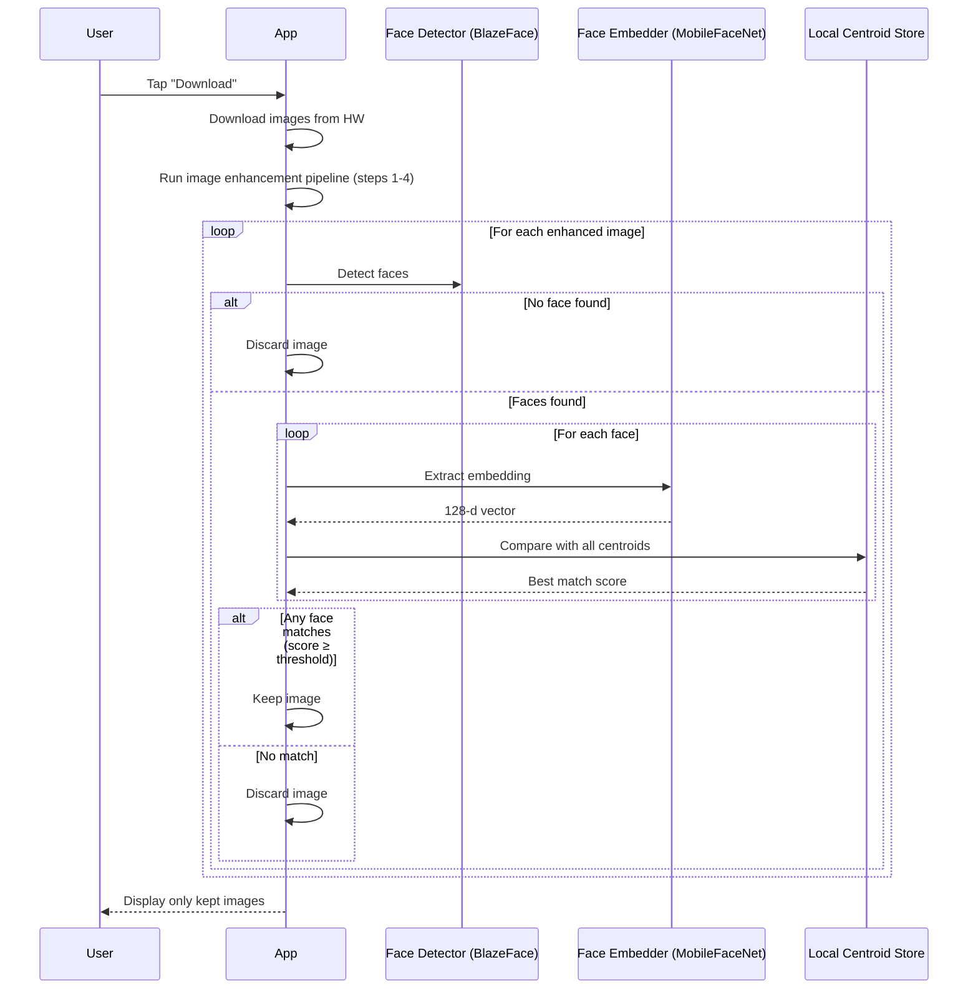
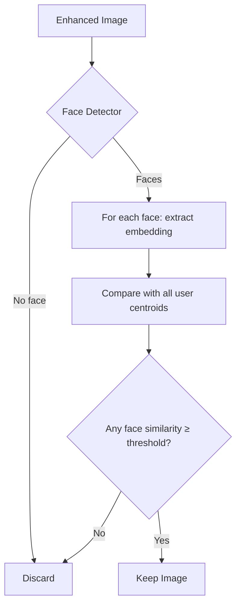
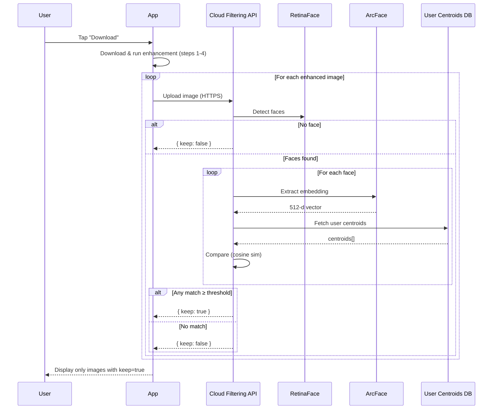

> From: https://chat.deepseek.com/a/chat/s/1ad2a55c-4e78-4e54-ac0d-1d5fb818b3a9

# you asked

message time: 2026-05-10 22:42:49

Background:

I am building a HW-SW system. HW consists of a wearable camera, and SW is a mobile app. The communication between HW (wearable camera) and SW (mobile app) is already established. 

This HW has a unique feature where is takes pictures of "moments", for example, someone smiling, someone full of joy, within a maximum of 6ft distance from the device. The max distance of 6 ft is the key. These would be egocentric photos. The feature is called "Moment Capture", and each moment capture session is started by the user (wearer of the HW) and a session lasts about 5 minutes Each session may produce 15-20 images. Key thing is it will only capture when it detects "sentiment" within 6 ft.

Sentiment detection and blur detection models and algorithms are responsibility of the HW and are already working.

The camera on the HW has a 110 degrees field of view, and captures 12 MP pictures in 3:4 aspect ratio. The ISP on the camera and other algorithms on the HW reject obstructed pictures, and blurred picture, while keeping relatively and reasonably "good" pictured.

Download of Photos:

Note: The images that need to be downloaded are not blurry as blur detection on HW already discarded blurry images. Now coming to the download picture pipeline.

Once the user connects their HW to the mobile app, and clicks on a button in the app, the app downloads the stored images from HW. These images are not displayed to the user right away, and go thru a post-processing pipeline using some CV models and CV algorithms to improve the quality of the photos. This pipeline is described below, and it exists already:

Step 1. Apply a local contrast enhancement model and algorithm to the photos to improve the color (bright photos even in dark light).

Step 2. Reduce noise on grainy pictures and make the pictures sharper by using a model for AI-based noise reduction.

Step 3. Correct tilt/horizon in the photos, if any. This stage corrects the tilt and crops any inappropriate areas in the photo resulting from tilt/horizon correction while maintaining 3:4 aspect ratio

Step 4: The last step uses another face detection model, and crops the photos such that the face (or faces) are in the center of the photo horizontally. This crop maintains a 3:4 ratio, and the maximum crop of step 4 and step 5 combined is 20% of the total image, which means resulting image after this pipeline is ~80% of the original image size, in 3:4 aspect ratio.

Problem:

You might have noticed that the above steps will result in captured moments photos from HW to mobile app with a good amount of image quality improvements. However there is one problem: since the HW doesn't have any ability to detect "favorite" or "intended" people that the user wants to capture when they are smiling, the HW captures photos of "anyone" smiling within 6 ft from the user.

Since HW takes pictures of "anyone" with matching "sentiments", it is highly probable it can pick pictures of strangers, and as per the business requirements and UX requirements we do not want to show pictures of strangers to the user of the HW and the app.

My Proposed Solution:

As part of initial user setup in the SW app, user will select multiple photos for 4-5 of their loved ones from their phone's photo gallery. We want to create clusters or buckets for each of these 4-5 people from their multiple pictures to serve as a reference. We need not name these clusters or identify these people, but we only need to understand this concept of clusters of similar faces. So ideally there will be 4-5 clusters in total, but I understand it could vary depending on image similarity and recognition.

After the images are downloaded and processed thru the image quality enhancements in my app, I want to run them thru a filtering process to discard images of people that the user did not select. In the filtering process, app needs to match each of these photos to check if the people or person in each of these images could match one or more people in these "clusters". We need not even know which cluster is a match. As long as there is a match, we keep the picture and if there is no match with any cluster we discard the picture. This will make sure users will see only images of people they know or people they selected.

Note: I know CV based models and algorithms are not a 100% deterministic.

Your Task:

Based on this background, I want you to write 2 proposals to build the clustering and filtering solution.
1. Proposal 1: Clustering and filtering happens on the mobile app, no data is sent to the cloud. Everything happens offline, there is no need for internet for user to download images, and is privacy focused. There is also no operational cost as we do not need cloud compute. Since the models on the mobile device cannot be very large or heavy, the reliability and predictability of clustering and filtering photos will be slightly lower.
Note: Mobile device are modern Android and iOS phones, so expect GPU capable of running TFLite/Mobile/Apple Metal models.

2. Proposal 2: Clustering and filtering happens on the cloud. In this case, data is sent to the cloud, download is dependent on availability of internet, and there could be privacy concerns. There would also be some operational costs for compute. Since we are running on the cloud, we could run large or heavy models with much higher reliability and predictability of clustering and filtering.

Remember that we are only interested in the pipeline after the images are downloaded and post-processed. We are only building solution and proposal for clustering and filtering. These proposals should include Mermaid sequence diagrams and flow charts, selection of models and algorithms, and design of the clustering and filtering pipeline. Mention pros/cons, expected reliability in terms of clustering and filtering.

Is everything clear? If you have any questions, please ask.

---

# deepseek response

I’ll propose two architectures for clustering and filtering after your existing image-enhancement pipeline. Both assume the user has already selected photos for 4–5 loved ones (each person’s photos form one “cluster”). The goal is to keep only images where at least one face matches any of these clusters.

---

## Proposal 1 – Fully On‑Device (Offline)

### Overview
All work happens on the phone after the enhancement pipeline. User reference clusters are created once during setup. Filtering runs locally for each downloaded image, with no data leaving the device.

### Components & Model Choices
| Step | Technology | Details |
|------|------------|---------|
| Face detection | **MediaPipe BlazeFace** (or Apple Vision) | Fast, GPU‑backed, works well for near‑field faces. |
| Face embedding | **MobileFaceNet** (TFLite) / **FaceNet‑small** (CoreML) | 128‑dim embedding, < 5 MB, optimised for mobile. |
| Cluster creation | **Per‑person centroid** (median of embeddings) | Store one centroid per loved one (4‑5 centroids). |
| Matching threshold | Cosine similarity ≤ 0.45 (tunable) | Determines “same identity”. |

### Pipeline – Setup Phase
1. User selects multiple photos per loved one from the phone gallery.  
2. For each photo: detect all faces (BlazeFace). If more than one face, user may be asked to confirm which is the target person (or we take the largest).  
3. Extract embedding for the target face using MobileFaceNet.  
4. Group embeddings per declared person → compute the centroid (median vector). Store the list of centroids (one per loved one) in local secure storage (Keychain/Keystore).  

### Pipeline – Filtering Phase (per downloaded image)
After the image has passed the 4‑step enhancement pipeline:

1. **Face detection** → locate all faces in the image.  
2. If **no face detected** → discard image.  
3. For each detected face:  
   a. Crop & align face to 112×112.  
   b. Extract embedding with MobileFaceNet.  
   c. Compare with every stored centroid (cosine similarity).  
   d. If at least one similarity ≥ threshold → mark as “known”.  
4. **Decision**: if at least one face is “known”, keep the image; otherwise discard.  

### Mermaid Sequence Diagram – Filtering (On-Device)


### Flow Chart – Filtering Decision


### Pros & Cons
| Pros | Cons |
|------|------|
| ✅ Complete privacy – no data leaves device | ❌ Model capacity limited – lower accuracy in extreme poses/lighting |
| ✅ Works offline – no internet needed | ❌ Slightly higher false‑positive/negative rate |
| ✅ Zero cloud compute cost | ❌ Setup requires careful face selection |
| ✅ Instant feedback after download | ❌ Embedded storage adds a few MB to app size |

**Expected Reliability**  
- True Positive Rate (known person correctly kept): **~85‑90%**  
- False Positive Rate (stranger incorrectly kept): **~5‑10%**  
*Values depend on threshold tuning; a stricter threshold improves privacy but may miss real loved ones.*

---

## Proposal 2 – Cloud‑Based

### Overview
Reference clusters are stored in the cloud. After the on‑device enhancement pipeline, images are uploaded to a cloud inference endpoint. A larger, more accurate model performs detection, embedding, and matching, returning a keep/discard decision per image.

### Components & Model Choices
| Step | Technology | Details |
|------|------------|---------|
| Face detection | **RetinaFace** (ResNet‑50) or **MTCNN** | Robust to scale, pose, occlusion. |
| Face embedding | **ArcFace** (ResNet‑100) / **MagFace** | 512‑dim, state‑of‑the‑art accuracy (LFW > 99.8%). |
| Clustering / centroid | Server‑side per‑user DB | Store centroids (or raw embeddings) in a managed DB (e.g., PostgreSQL with pgvector, or Firebase/Firestore). |
| Matching | Cosine similarity ≤ 0.35 | Tight threshold, tuned for high precision. |
| Infrastructure | Serverless GPU (AWS Lambda + GPU, RunPod, etc.) or containerised API | Auto‑scales, GPU acceleration. |

### Pipeline – Setup Phase
1. User selects photos for each loved one inside the app.  
2. App uploads the face crops (after on‑device detection) or the full images to a dedicated setup endpoint.  
3. Cloud runs RetinaFace → ArcFace embedding → stores embeddings grouped by person.  
4. The cloud computes and saves the centroid per person in the user’s profile.  
5. (Optional) Identity is never labelled; only the centroid vectors are stored.

### Pipeline – Filtering Phase
1. After download and enhancement, app uploads each image (or a compressed version) to the filtering endpoint.  
2. Cloud:  
   a. Detect faces (RetinaFace).  
   b. Extract embeddings (ArcFace).  
   c. Compare with user’s centroids.  
   d. Return JSON: `{ keep: true/false }` (plus optional match score).  
3. App discards images marked `false`, keeps the rest.

### Mermaid Sequence Diagram – Filtering (Cloud)


### Flow Chart – Cloud Filtering
```mermaid
flowchart TD
    A[Enhanced Image] --> B[Upload to Cloud]
    B --> C{Face Detector (RetinaFace)}
    C -->|No face| D[Return keep=false]
    C -->|Faces| E[ArcFace embeddings for each face]
    E --> F[Fetch user centroids from DB]
    F --> G{Any cosine similarity ≥ threshold?}
    G -->|Yes| H[Return keep=true]
    G -->|No| D
    H --> I[App keeps image]
    D --> J[App discards image]
```

### Pros & Cons
| Pros | Cons |
|------|------|
| ✅ Very high accuracy (SOTA models) | ❌ Requires internet – no offline filtering |
| ✅ Robust to extreme poses, lighting, ethnicities | ❌ Privacy concerns – face images sent to cloud (mitigation: send only face crops, encrypt in transit/at rest, and delete after processing) |
| ✅ Can leverage continuous model updates | ❌ Operational cost – GPU inference per image (approx. $0.001–$0.005/image depending on provider) |
| ✅ Easy to scale and manage | ❌ Latency – round‑trip per image (can be batched to reduce overhead) |

**Expected Reliability**  
- True Positive Rate: **>95%** (often >99% for well‑enrolled users)  
- False Positive Rate: **<1%** with a strict threshold  
*Real‑world performance will be close to the ArcFace LFW benchmark, assuming quality enrollment images.*

---

## Summary Comparison
| | On‑Device (Proposal 1) | Cloud (Proposal 2) |
|---|---|---|
| **Privacy** | Excellent – all data stays on phone | Requires sending images; needs strong encryption & data handling policy |
| **Cost** | Zero recurring cost | Pay‑per‑use GPU inference + storage |
| **Offline use** | Fully offline | Internet required |
| **Accuracy** | Good (85‑90% TPR) | Excellent (>95% TPR) |
| **Setup complexity** | One‑time on‑device clustering | Cloud provisioning, DB, API development |
| **Latency** | Near‑instant | Network round‑trip (can be parallelised) |

Both proposals achieve the goal of removing strangers and only showing loved ones. The choice depends on your priority: **privacy & offline capability** (on‑device) versus **maximum reliability & scalability** (cloud). A hybrid approach (on‑device first, cloud fallback) is also possible, but the above two proposals cover the pure cases.