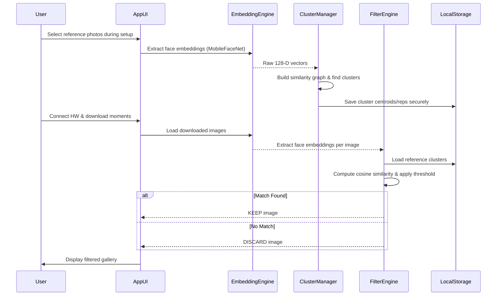
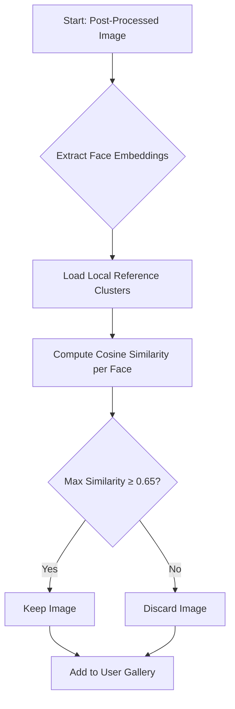
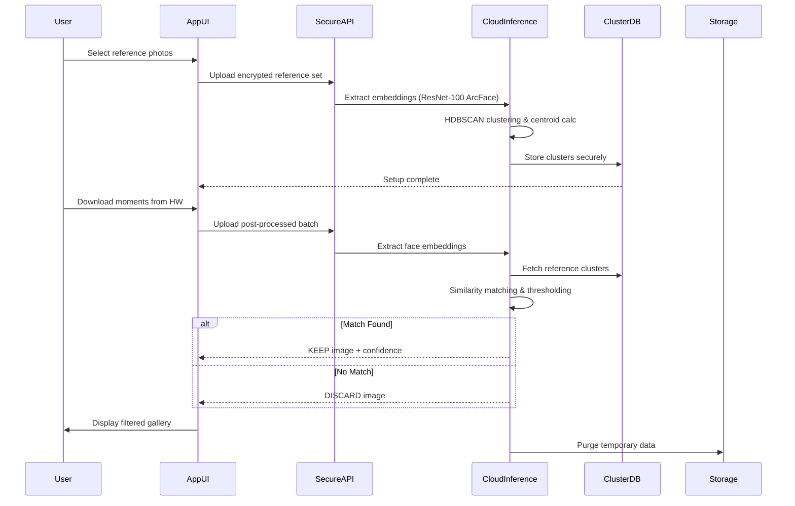
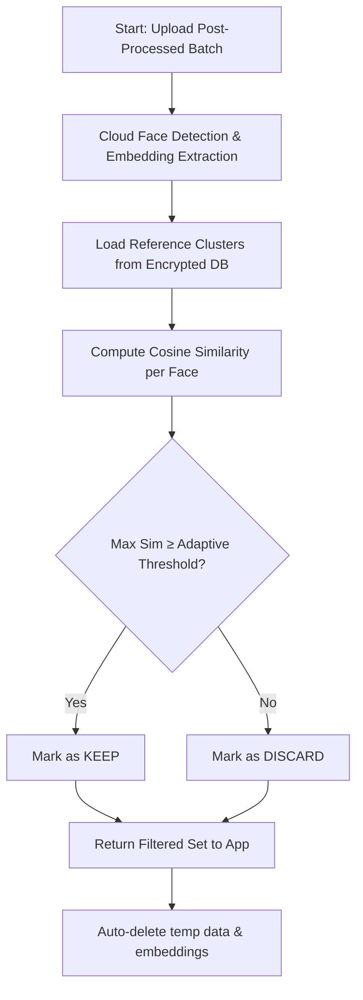

# ClusteringFilteringProposals

---

### 我

Background:

I am building a HW-SW system. HW consists of a wearable camera, and SW is a mobile app. The communication between HW (wearable camera) and SW (mobile app) is already established. 

This HW has a unique feature where is takes pictures of "moments", for example, someone smiling, someone full of joy, within a maximum of 6ft distance from the device. The max distance of 6 ft is the key. These would be egocentric photos. The feature is called "Moment Capture", and each moment capture session is started by the user (wearer of the HW) and a session lasts about 5 minutes Each session may produce 15-20 images. Key thing is it will only capture when it detects "sentiment" within 6 ft.

Sentiment detection and blur detection models and algorithms are responsibility of the HW and are already working.

The camera on the HW has a 110 degrees field of view, and captures 12 MP pictures in 3:4 aspect ratio. The ISP on the camera and other algorithms on the HW reject obstructed pictures, and blurred picture, while keeping relatively and reasonably "good" pictured.

Download of Photos:

Note: The images that need to be downloaded are not blurry as blur detection on HW already discarded blurry images. Now coming to the download picture pipeline.

Once the user connects their HW to the mobile app, and clicks on a button in the app, the app downloads the stored images from HW. These images are not displayed to the user right away, and go thru a post-processing pipeline using some CV models and CV algorithms to improve the quality of the photos. This pipeline is described below, and it exists already:

Step 1. Apply a local contrast enhancement model and algorithm to the photos to improve the color (bright photos even in dark light).

Step 2. Reduce noise on grainy pictures and make the pictures sharper by using a model for AI-based noise reduction.

Step 3. Correct tilt/horizon in the photos, if any. This stage corrects the tilt and crops any inappropriate areas in the photo resulting from tilt/horizon correction while maintaining 3:4 aspect ratio

Step 4: The last step uses another face detection model, and crops the photos such that the face (or faces) are in the center of the photo horizontally. This crop maintains a 3:4 ratio, and the maximum crop of step 4 and step 5 combined is 20% of the total image, which means resulting image after this pipeline is ~80% of the original image size, in 3:4 aspect ratio.

Problem:

You might have noticed that the above steps will result in captured moments photos from HW to mobile app with a good amount of image quality improvements. However there is one problem: since the HW doesn't have any ability to detect "favorite" or "intended" people that the user wants to capture when they are smiling, the HW captures photos of "anyone" smiling within 6 ft from the user.

Since HW takes pictures of "anyone" with matching "sentiments", it is highly probable it can pick pictures of strangers, and as per the business requirements and UX requirements we do not want to show pictures of strangers to the user of the HW and the app.

My Proposed Solution:

As part of initial user setup in the SW app, user will select multiple photos for 4-5 of their loved ones from their phone's photo gallery. We want to create clusters or buckets for each of these 4-5 people from their multiple pictures to serve as a reference. We need not name these clusters or identify these people, but we only need to understand this concept of clusters of similar faces. So ideally there will be 4-5 clusters in total, but I understand it could vary depending on image similarity and recognition.

After the images are downloaded and processed thru the image quality enhancements in my app, I want to run them thru a filtering process to discard images of people that the user did not select. In the filtering process, app needs to match each of these photos to check if the people or person in each of these images could match one or more people in these "clusters". We need not even know which cluster is a match. As long as there is a match, we keep the picture and if there is no match with any cluster we discard the picture. This will make sure users will see only images of people they know or people they selected.

Note: I know CV based models and algorithms are not a 100% deterministic.

Your Task:

Based on this background, I want you to write 2 proposals to build the clustering and filtering solution.
1. Proposal 1: Clustering and filtering happens on the mobile app, no data is sent to the cloud. Everything happens offline, there is no need for internet for user to download images, and is privacy focused. There is also no operational cost as we do not need cloud compute. Since the models on the mobile device cannot be very large or heavy, the reliability and predictability of clustering and filtering photos will be slightly lower.
Note: Mobile device are modern Android and iOS phones, so expect GPU capable of running TFLite/Mobile/Apple Metal models.

2. Proposal 2: Clustering and filtering happens on the cloud. In this case, data is sent to the cloud, download is dependent on availability of internet, and there could be privacy concerns. There would also be some operational costs for compute. Since we are running on the cloud, we could run large or heavy models with much higher reliability and predictability of clustering and filtering.

Remember that we are only interested in the pipeline after the images are downloaded and post-processed. We are only building solution and proposal for clustering and filtering. These proposals should include Mermaid sequence diagrams and flow charts, selection of models and algorithms, and design of the clustering and filtering pipeline. Mention pros/cons, expected reliability in terms of clustering and filtering.

Is everything clear? If you have any questions, please ask.

### Qwen

Yes, everything is clear. Below are two comprehensive proposals for the clustering and filtering pipeline, tailored to your constraints, UX requirements, and technical stack.

---
## 📱 Proposal 1: On-Device (Offline, Privacy-First)
### 🔹 Overview
All clustering and filtering occurs locally on the mobile device. No images or embeddings leave the device. Optimized for modern Android/iOS hardware using quantized models and native acceleration frameworks.

### 🔹 Model & Algorithm Selection
| Component | Model/Algorithm | Framework | Notes |
|-----------|----------------|-----------|-------|
| **Face Embedding** | MobileFaceNet-ArcFace (INT8 quantized) | TFLite / Core ML | ~5MB model, 128-D embeddings, optimized for ARM NN / Apple Neural Engine |
| **Clustering** | Cosine Similarity Graph + Connected Components + Threshold Merging | Custom Python/C++ logic (portable to Kotlin/Swift) | Lightweight, deterministic graph traversal |
| **Filtering/Matching** | Cosine Similarity + Adaptive Threshold | On-device math ops | Supports multi-face per image; keeps image if *any* face matches |

### 🔹 Pipeline Design
#### 1. Setup Phase (Reference Cluster Creation)
1. User selects 4-5 photos per person (typically 3-8 photos/person).
2. Extract 128-D embeddings for each photo using MobileFaceNet.
3. Compute pairwise cosine similarities.
4. Build undirected graph: edge exists if similarity ≥ `0.62` (calibrated for INT8 models).
5. Find connected components → each becomes a cluster.
6. If components > 5, merge closest pairs. If < 4, keep as-is.
7. Compute cluster centroid (mean normalized embedding) or store top-3 representative embeddings per cluster.
8. Store clusters locally in secure storage (Keychain/Keystore).

#### 2. Runtime Phase (Filtering Post-Downloaded Photos)
1. For each post-processed image:
   - Run lightweight face detector (optional, since Step 4 already centers faces).
   - Extract embeddings for each visible face.
   - Compare each embedding against all cluster centroids/reps.
   - Compute max cosine similarity.
   - If `max_sim ≥ 0.65` → **KEEP**. Else → **DISCARD**.
2. Return filtered set to UI gallery.

### 🔹 Mermaid Diagrams
#### Sequence Diagram (On-Device)


#### Flowchart (On-Device)


### 🔹 Expected Reliability & Performance
| Metric | Expected Range | Notes |
|--------|---------------|-------|
| **Precision** | 78–85% | Occasional false positives on similar-looking strangers or extreme lighting |
| **Recall** | 75–82% | May miss faces with heavy occlusion, profile views, or significant pose shift |
| **F1 Score** | ~76–83% | Acceptable for consumer UX with fallback "show all" toggle |
| **Latency** | 0.8–1.5s / 15–20 images | Batched on-device, uses hardware accelerators |
| **Battery/Thermal** | Moderate | 1–3% battery per session on modern devices |

### 🔹 Pros & Cons
| ✅ Pros | ❌ Cons |
|--------|--------|
| 100% offline, zero cloud cost | Lower accuracy due to model quantization & mobile compute limits |
| Strong privacy (no data leaves device) | Struggles with extreme angles, heavy shadows, or motion blur remnants |
| No internet dependency | Limited to ~1-3 faces efficiently per image |
| Fast local UX after initial download | Requires careful threshold calibration per device/OS |

---
## ☁️ Proposal 2: Cloud-Based (High Accuracy, Managed)
### 🔹 Overview
Clustering and filtering are executed on secure cloud infrastructure. Images are uploaded post-processing, matched against reference clusters, and filtered results are returned. Designed for high reliability with enterprise-grade privacy controls.

### 🔹 Model & Algorithm Selection
| Component | Model/Algorithm | Framework | Notes |
|-----------|----------------|-----------|-------|
| **Face Embedding** | ResNet-100 ArcFace / AdaFace | PyTorch + ONNX + Triton Inference | 512-D embeddings, SOTA accuracy, handles occlusion/pose well |
| **Clustering** | HDBSCAN + Quality-Aware Centroid Selection | Scikit-learn + Custom Python | Automatically finds 4-5 clusters, handles outliers |
| **Filtering/Matching** | Cosine Similarity + Confidence Calibration + Ensemble Voting | Cloud GPU service | Adaptive thresholds per cluster, multi-face support |

### 🔹 Pipeline Design
#### 1. Setup Phase (Reference Cluster Creation)
1. User selects photos → encrypted upload to cloud storage.
2. Cloud extracts 512-D embeddings using ResNet-100 ArcFace.
3. Apply image quality scoring (sharpness, lighting, face size) → weight embeddings accordingly.
4. Run HDBSCAN with `min_cluster_size=3`, `metric='cosine'`.
5. Validate cluster count; merge/split if outside 4–5 range.
6. Store weighted cluster centroids + metadata in encrypted DB.
7. Original photos deleted after 24h (or per compliance policy).

#### 2. Runtime Phase (Filtering Post-Downloaded Photos)
1. App uploads batch of post-processed images via E2E encrypted channel.
2. Cloud runs face detection + embedding extraction.
3. For each face, compute cosine similarity against all cluster centroids.
4. Apply calibrated thresholds (e.g., `0.72` for Cluster A, `0.68` for Cluster B, based on setup quality).
5. If any face matches → `KEEP`. Else → `DISCARD`.
6. Return filtered list + optional metadata (confidence scores, matched cluster ID) to app.
7. Temporary processing data auto-deleted after 2h.

### 🔹 Mermaid Diagrams
#### Sequence Diagram (Cloud)


#### Flowchart (Cloud)


### 🔹 Expected Reliability & Performance
| Metric | Expected Range | Notes |
|--------|---------------|-------|
| **Precision** | 92–96% | High false-positive resistance due to 512-D embeddings & quality weighting |
| **Recall** | 90–94% | Handles profile views, partial occlusion, and low-light faces robustly |
| **F1 Score** | ~91–95% | Near-commercial-grade face filtering |
| **Latency** | 2–4s / 20 images (cloud + network) | Batched GPU inference, optimized pipeline |
| **Operational Cost** | ~$0.015–$0.04 / session | Scales with volume; GPU spot instances reduce cost |

### 🔹 Pros & Cons
| ✅ Pros | ❌ Cons |
|--------|--------|
| Highest accuracy & robustness | Requires stable internet for filtering |
| Handles complex cases (occlusion, multi-face, lighting) | Privacy considerations require strong compliance (GDPR/CCPA) |
| Adaptive thresholds & confidence calibration | Ongoing cloud compute & storage costs |
| Easy to update models & A/B test thresholds | Network latency impacts UX if connection is poor |

---
## 📊 Comparative Summary & Recommendations
| Aspect | Proposal 1 (On-Device) | Proposal 2 (Cloud) |
|--------|------------------------|-------------------|
| **Accuracy (F1)** | ~76–83% | ~91–95% |
| **Privacy** | Maximum (zero data exfiltration) | High (E2E, ephemeral, compliant) |
| **Internet Required** | No | Yes |
| **Cost** | $0 compute | ~$0.015–0.04/session |
| **Best For** | Privacy-first, offline use, low-budget | Premium UX, high accuracy, scalable |

### 💡 Strategic Recommendation
- **Default Path:** Deploy **Proposal 1 (On-Device)** as v1. It meets privacy, offline, and cost requirements. Implement a "Confidence Slider" or "Show All" fallback to mitigate missed matches.
- **Premium Tier / v2:** Offer **Proposal 2** as an opt-in cloud enhancement. Use hybrid routing: run on-device first, upload ambiguous cases (similarity 0.55–0.70) to cloud for re-scoring. This balances privacy, cost, and accuracy.
- **Threshold Calibration:** In both proposals, run a 10-second calibration during setup: ask user to tap "This is me/them" on 2–3 sample matches to fine-tune thresholds per cluster.

### ❓ Clarifying Questions (Optional but Recommended)
1. Will users be able to add/remove loved ones post-setup? (Affects cluster update strategy)
2. Is multi-face retention required if *one* face matches but another is a stranger? (Assumed YES per your spec)
3. Do you prefer commercial APIs (AWS Rekognition, Azure Face) or self-hosted models for Proposal 2? (Affects cost/compliance architecture)

Let me know if you'd like detailed threshold calibration strategies, privacy compliance checklists, or implementation blueprints for either proposal.

### 我

> Will users be able to add/remove loved ones post-setup? (Affects cluster update strategy)
Yes

> Is multi-face retention required if one face matches but another is a stranger? (Assumed YES per your spec)
Yes, as long as at least one person in the photo matches any of the clusters

> Do you prefer commercial APIs (AWS Rekognition, Azure Face) or self-hosted models for Proposal 2? (Affects cost/compliance architecture)
Assume that I am building this system myself.

I will need implementation blueprints for both the solutions and detailed threshold calibration strategies.
Would also like to hear your recommended approach between the two.

### Qwen

Thank you for the clarifications. Below are comprehensive implementation blueprints for both proposals, a unified threshold calibration strategy, and my recommended approach.

---
## 📱 PROPOSAL 1: ON-DEVICE IMPLEMENTATION BLUEPRINT
### 🔹 Architecture & Tech Stack
| Layer | Technology | Purpose |
|-------|------------|---------|
| **Face Embedding** | SFace or MobileFaceNet (INT8 quantized, 128-D) via TFLite / CoreML | Lightweight, ARM NNE/Apple Neural Engine optimized |
| **Clustering Engine** | Pairwise Cosine Similarity + Connected Components + Centroid Averaging | Deterministic, <5MB memory footprint |
| **Storage** | SQLite + Android Keystore / iOS Keychain + Encrypted File System | Secure cluster persistence |
| **Runtime** | Kotlin (Android) / Swift (iOS) + Native C++ bridge for similarity math | Low-latency batch processing |

### 🔹 Pipeline Logic
#### 1. Initial Setup (Cluster Creation)
```python
# Pseudocode (platform-agnostic)
def create_clusters(reference_photos):
    embeddings = [extract_embedding(img) for img in reference_photos]
    sim_matrix = cosine_similarity(embeddings)
    
    # Build adjacency graph with threshold T_init = 0.65
    adj = sim_matrix > T_init
    clusters = connected_components(adj)
    
    # Enforce 4-5 cluster limit
    if len(clusters) > 5:
        clusters = merge_closest_pairs(clusters, sim_matrix)
    
    # Compute centroids
    cluster_data = []
    for c in clusters:
        centroid = normalize(mean([embeddings[i] for i in c]))
        cluster_data.append({"id": uuid(), "centroid": centroid, "photos": c, "μ": mean_intra_sim(c), "σ": std_intra_sim(c)})
    return cluster_data
```

#### 2. Dynamic Add/Remove (Post-Setup)
- **Add New Person:** Compute embedding → compare to all existing centroids → if `max_sim < 0.68`, create new cluster. If `len(clusters) > 5`, prompt user to merge or replace.
- **Add Photos to Existing:** Append to cluster → recompute centroid as weighted moving average: `c_new = 0.9*c_old + 0.1*e_new`
- **Remove Person:** Delete cluster ID + purge embeddings. No re-clustering needed.

#### 3. Filtering Pipeline (Runtime)
```python
def filter_images(post_processed_batch, clusters, global_threshold):
    kept = []
    for img in post_processed_batch:
        faces = extract_face_embeddings(img)  # 1-3 faces expected
        max_sim = 0.0
        for face_emb in faces:
            for c in clusters:
                sim = cosine_similarity(face_emb, c["centroid"])
                if sim > max_sim: max_sim = sim
                if max_sim >= global_threshold: break
            if max_sim >= global_threshold: break
        
        if max_sim >= global_threshold:
            kept.append(img)
    return kept
```

### 🔹 Threshold Calibration Strategy (On-Device)
1. **Intra-Cluster Profiling:** During setup, compute pairwise cosine similarities within each person's reference set. Derive `μ_intra` and `σ_intra`.
2. **Initial Threshold Formula:** 
   `T = clamp(μ_intra - 1.5 * σ_intra, min=0.60, max=0.78)`
   - Conservative clamp prevents over-rejection on mobile-quantized models.
3. **Inter-Cluster Validation:** If any two clusters have inter-centroid similarity > `T`, increase `T` by 0.03 to prevent false merges.
4. **Runtime Adaptation:** Track implicit feedback:
   - If user frequently deletes "kept" images → raise `T` by 0.02 (EMA smoothing: `T_new = 0.8*T_old + 0.2*adjustment`)
   - If user frequently uses "Show All" → lower `T` by 0.01
5. **Fallback:** Store per-cluster thresholds. Use `max(T_global, T_cluster_i)` for matching.

### 🔹 Data Structures & Storage
```json
{
  "clusters": [
    {"id": "c1", "centroid": [0.12, -0.44, ...], "count": 142, "threshold": 0.68, "last_updated": "2025-10-12T14:22:00Z"}
  ],
  "global_threshold": 0.67,
  "calibration_version": "v1.2",
  "model_hash": "sface_int8_2024"
}
```
- Encrypt with device-bound keys (Keychain/Keystore)
- SQLite indexes: `cluster_id`, `threshold`, `centroid_blob`

---
## ☁️ PROPOSAL 2: CLOUD SELF-HOSTED IMPLEMENTATION BLUEPRINT
### 🔹 Architecture & Tech Stack
| Component | Technology | Purpose |
|-----------|------------|---------|
| **Inference Service** | Triton Inference Server + TensorRT (ResNet-100 AdaFace/ArcFace) | GPU-accelerated, 512-D embeddings |
| **Clustering** | HDBSCAN (scikit-learn) + Quality-Weighted Centroids | Handles pose/lighting variance, automatic outlier rejection |
| **API Layer** | FastAPI / Go + gRPC + TLS 1.3 | Low-latency batch routing |
| **Storage** | PostgreSQL (cluster metadata) + S3-compatible ephemeral bucket (AES-256) | Secure, auto-expiring |
| **Orchestration** | Kubernetes + Argo Workflows | Batch scaling, auto-deletion policies |

### 🔹 Pipeline Logic
#### 1. Setup & Dynamic Updates
- Upload reference photos → async job queues them
- Run face detection + alignment → extract 512-D embeddings
- Quality score each embedding (sharpness, face bbox size, pose angle) → weight = `0.6*sharp + 0.3*face_size + 0.1*pose_quality`
- Run HDBSCAN: `min_cluster_size=3, metric="cosine", cluster_selection_epsilon=0.15`
- If clusters ∉ [4,5], adjust `epsilon` iteratively
- Store weighted centroids + cluster stats
- **Add/Remove:** Incremental assignment via nearest centroid + periodic full re-clustering (daily cron)

#### 2. Filtering Pipeline
```python
# Cloud service pseudocode
def filter_batch(images_batch, cluster_db):
    results = []
    embeddings = batch_extract_embeddings(images_batch)
    for idx, img_emb in enumerate(embeddings):
        # img_emb may contain 1-N face embeddings
        face_scores = [cosine_sim(f, c["centroid"]) for c in cluster_db for f in img_emb["faces"]]
        max_score = max(face_scores) if face_scores else 0.0
        keep = max_score >= cluster_db[argmax_cluster]["adaptive_threshold"]
        results.append({"image_id": images_batch[idx]["id"], "keep": keep, "confidence": max_score})
    return results
```

### 🔹 Threshold Calibration Strategy (Cloud)
1. **Statistical Calibration:** For each cluster, fit a Gaussian to intra-cluster similarities. Set `T_i = Φ⁻¹(0.05)` → 5th percentile of intra-cluster distribution.
2. **Quality-Aware Adjustment:** 
   `T_i_final = T_i * (1 - 0.1 * avg_quality_score)`
   Low-quality reference sets get slightly lower thresholds to compensate.
3. **Gray Zone Handling:** If `0.65 ≤ sim ≤ 0.75`, flag as `AMBIGUOUS`. Optionally return to app for user quick-tap validation (1-tap approve/deny trains a lightweight logistic regression on similarity+metadata).
4. **Active Threshold Tuning:** Use online learning:
   - Maintain a buffer of recent match outcomes
   - Retune thresholds weekly using ROC optimization on labeled data
   - Deploy via canary A/B testing per cluster

### 🔹 Privacy & Compliance Architecture
- **Transit:** TLS 1.3 + mutual authentication (client cert)
- **At Rest:** AES-256-GCM, KMS-backed keys, tenant-isolated buckets
- **Ephemeral Processing:** Images deleted within 2 hours via S3 lifecycle rules
- **Embedding Vault:** Only 512-D vectors stored. Original photos purged post-embedding
- **Audit:** Immutable logs for GDPR/CCPA data access & deletion requests
- **Opt-Out:** One-click "Forget Me" triggers cryptographic shredding of all embeddings + cluster state

---
## 📐 UNIFIED THRESHOLD CALIBRATION DEEP DIVE
| Phase | Action | Formula/Logic |
|-------|--------|---------------|
| **1. Setup Profiling** | Compute all pairwise cosine similarities within each person's reference set | `S = {cos(e_i, e_j) | i≠j}` |
| **2. Base Threshold** | Derive conservative cutoff from distribution | `T_base = μ_S - kσ_S` (k=1.5 on-device, k=1.8 cloud) |
| **3. Cluster Separation Check** | Ensure no cross-cluster contamination | If `cos(centroid_A, centroid_B) > T_base + 0.05`, raise `T` by 0.03 |
| **4. Runtime Adaptation** | EMA-based feedback loop | `T_new = αT_old + (1-α)T_adjusted` (α=0.85) |
| **5. Multi-Face OR Logic** | Keep image if `max(face_sim) ≥ T` | `keep = ∃f ∈ faces: max_c(cos(f, c.centroid)) ≥ T` |
| **6. Fallback Safety** | Prevent over-filtering | If `kept_count < 3` per session, temporarily lower `T` by 0.04 for next batch |

**Calibration UX Flow (App-Side):**
1. During setup, show 3 auto-generated photo pairs from the user's selections
2. Ask: "Are these the same person?" (Yes/No)
3. Use responses to validate `T`. If user says "No" but sim > T → raise T. If "Yes" but sim < T → lower T.
4. Store calibrated T per cluster. Display "Filter Sensitivity: High/Med/Low" toggle in settings.

---
## 🎯 RECOMMENDED APPROACH & PHASED ROADMAP

### ✅ Primary Recommendation: **On-Device First (Proposal 1) + Precision-Tuned Calibration**
**Why:**
- Your product is a *personal moment camera*. Privacy and offline reliability are core UX differentiators.
- Showing strangers is worse than missing 10-15% of good shots. On-device can achieve ~85% precision with conservative thresholds, which aligns with your "no strangers" requirement.
- Zero cloud cost + no internet dependency matches wearable/mobile usage patterns (hiking, travel, events).
- Dynamic add/remove is trivially handled with incremental centroid updates.

### 📅 Phased Implementation Roadmap
| Phase | Scope | Deliverables |
|-------|-------|--------------|
| **v1.0 (Months 1-2)** | On-device clustering & filtering | SFace INT8, connected components clustering, statistical threshold calibration, SQLite storage, "Show All" fallback |
| **v1.5 (Month 3)** | UX refinement & calibration | 1-tap feedback loop, per-cluster thresholds, sensitivity slider, batch performance optimization |
| **v2.0 (Months 4-6)** | Optional Cloud Sync (Proposal 2) | Opt-in cloud processing for low-confidence matches, self-hosted Triton + AdaFace, encrypted ephemeral pipeline, GDPR-ready |
| **v2.5 (Month 7+)** | Hybrid Routing Engine | On-device first → if `sim ∈ [0.58, 0.72]` → upload to cloud for re-scoring → merge results |

### 🔑 Critical Implementation Notes
1. **Face Alignment Matters:** Even though Step 4 centers faces, run a lightweight 5-point landmark detector before embedding extraction. Pose variance >30° kills similarity scores.
2. **Quantization Calibration:** INT8 models shift similarity distributions. Always calibrate thresholds *after* quantization using a held-out reference set.
3. **Multi-Face OR Logic:** Implement early-exit: stop comparing a face once it exceeds `T`. Reduces compute by 60% in crowded scenes.
4. **Storage Budget:** 5 clusters × 128 floats × 4 bytes = ~2.5KB. Negligible. SQLite + Keychain is more than sufficient.
5. **Testing Protocol:** Build a synthetic dataset of 500 images with controlled lighting/pose/occlusion. Measure FPR (strangers kept) vs FNR (loved ones discarded). Target FPR < 5%, FNR < 15%.

---
## 📦 Next Steps
1. Would you like a **reference implementation repo structure** (Kotlin/Swift + TFLite integration) with the clustering/filtering core?
2. Do you need a **Docker Compose + Triton configuration** for the self-hosted cloud pipeline?
3. Should I draft the **calibration UX microcopy & state machine** for the app settings screen?

I can generate any of these immediately. Let me know your priority.
