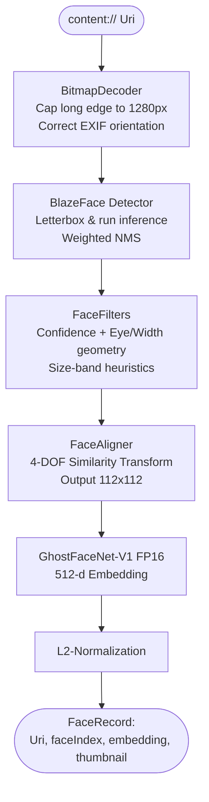

# FaceMesh — System Architecture & Pipeline Walkthrough

This document provides a comprehensive technical walkthrough of **FaceMesh**, an on-device facial clustering and matching system. It details the complete lifecycle of a photograph—from raw storage URI to a persisted face cluster or matching decision—mapping high-level concepts from the **Image Pipeline Whitepaper** to concrete **Python prototypes (`tools/`)** and **Kotlin implementations (`app/`)**.

---

## 1. System Architecture Overview

FaceMesh is designed as a localized image intelligence pipeline that solves two primary user flows:
1. **Clusterify:** Groups similar faces within a selection of photos into cohesive clusters without prior knowledge of who is in the images.
2. **Filter:** Matches face embeddings from newly imported/triaged photos against a set of user-selected target clusters.

### The Standard Image Pipeline
Both flows run each input image through the unified **`FaceProcessor`** pipeline:

```
Uri ➔ Bitmap Decoder ➔ BlazeFace (Detector) ➔ FaceFilters ➔ FaceAligner ➔ GhostFaceNet (Embedder) ➔ L2-Norm ➔ FaceRecord
```



---

## 2. Deep-Dive: The 7 Pipeline Stages

### Stage 1: Decode & Downsample
* **Files:** [BitmapDecoder.kt](file:///Users/gifty/Development/FaceMesh/app/src/main/kotlin/com/alifesoftware/facemesh/media/BitmapDecoder.kt)
* **Goal:** SAFELY turn a raw `content://` Uri into an EXIF-correct ARGB_8888 bitmap capped to standard dimensions.
* **Key Design Decisions:**
  * **Two-Pass Decode:** Reads image dimensions (`inJustDecodeBounds = true`) first. If the long edge exceeds `1280 px` (`PipelineConfig.Decode.maxLongEdgePx`), it computes an `inSampleSize` (power-of-two) to downsample during the second pass. This prevents high-resolution (e.g., 24 MP) images from causing Out-Of-Memory (OOM) errors.
  * **EXIF Correction:** The orientation matrix is applied immediately post-decode so all subsequent stages process the visual coordinates exactly as the user sees them.

---

### Stage 2: Face Detection (BlazeFace)
* **Files:** 
  * *Kotlin:* [BlazeFaceShortRangeDetector.kt](file:///Users/gifty/Development/FaceMesh/app/src/main/kotlin/com/alifesoftware/facemesh/ml/BlazeFaceShortRangeDetector.kt), [BlazeFaceFullRangeDetector.kt](file:///Users/gifty/Development/FaceMesh/app/src/main/kotlin/com/alifesoftware/facemesh/ml/BlazeFaceFullRangeDetector.kt)
  * *Python:* [reference_embed.py](file:///Users/gifty/Development/FaceMesh/tools/reference_embed.py#L74-L378)
* **Goal:** Detect coordinates of faces and extract 6 key landmarks (Right Eye, Left Eye, Nose Tip, Mouth Center, Right Ear, Left Ear).

#### Variant Comparison
FaceMesh provides two specialized, independent BlazeFace detectors:

| Variant | Input Size | Anchors | Anchor Configuration | Target Use Case |
| :--- | :---: | :---: | :---: | :--- |
| **Short-range** | 128×128 | 896 | `16x16x2` + `8x8x6` | Selfie-distance, frontal-only faces |
| **Full-range** | 192×192 | 2304 | `48x48x1` (stride 4) | Group photos, distant, or off-axis faces |

> [IMPORTANT]
> Since May 2026, the **`FULL_RANGE`** detector is the default variant. Empirical testing showed a **>2x increase in recall** (detecting 32 faces vs 15 on a 25-photo evaluation set), recovering critical faces in group shots with tighter same-person cosine distances.

#### Weighted Non-Maximum Suppression (NMS)
Unlike standard hard NMS (which discards overlapping boxes), BlazeFace implements **weighted NMS**. If multiple overlapping anchor boxes have an IoU > `0.30` (`PipelineConfig.Detector.nmsIouThreshold`), their bounding box boundaries and landmark coordinates are merged using a score-weighted average:

$$\text{Merged Coordinate} = \frac{\sum (Coordinate_i \times Score_i)}{\sum Score_i}$$

This stabilizes the bounding box and landmarks, preventing coordinate jitter that would corrupt downstream alignment.

---

### Stage 3: FaceFilters (Post-Detection Heuristics)
* **Files:** [FaceFilters.kt](file:///Users/gifty/Development/FaceMesh/app/src/main/kotlin/com/alifesoftware/facemesh/ml/FaceFilters.kt)
* **Goal:** Low-cost, deterministic geometric filters that reject non-face artifacts *before* paying the performance penalty of alignment and embedder passes.
* **Key Heuristics:**
  1. **Confidence Floor:** Re-asserts `score >= 0.55` (aligned with detector's threshold).
  2. **Geometric Sanity Check:** Checks the ratio of inter-eye distance to bounding box width:
     $$\text{Ratio} = \frac{\text{Distance}(\text{Right Eye}, \text{Left Eye})}{\text{Bounding Box Width}}$$
     Real human faces cluster around `~0.40`. Rejections occur if $\text{Ratio} \notin [0.25, 0.65]$, effectively culling false-positive detections on shoulders, hands, or patterns.
  3. **Size-Outlier Filter:** Compares face sizes in the image against the median face size. It has three modes defined in [PipelineConfig.kt](file:///Users/gifty/Development/FaceMesh/app/src/main/kotlin/com/alifesoftware/facemesh/config/PipelineConfig.kt#L206-L360):
     * `DISABLED` *(Production Default)*: Prevents dropping small background/foreground faces in mixed-depth group shots.
     * `EXTREME_OUTLIERS_ONLY`: Drops faces with a width $< 0.25 \times \text{median}$ or $> 4.0 \times \text{median}$.
     * `SYMMETRIC_BAND`: Restricts faces to a strict symmetric margin around the median.
     * **Short-circuit:** If $N \ge 4$ faces are detected, the size-outlier stage is completely bypassed because the photo is flagged as a group shot, where size variance is expected.

---

### Stage 4: Face Alignment (Least-Squares Similarity)
* **Files:**
  * *Kotlin:* [FaceAligner.kt](file:///Users/gifty/Development/FaceMesh/app/src/main/kotlin/com/alifesoftware/facemesh/ml/FaceAligner.kt)
  * *Python:* [reference_embed.py](file:///Users/gifty/Development/FaceMesh/tools/reference_embed.py#L383-L514)
* **Goal:** Warp the detected face bounding box into the canonical 112x112 ArcFace template posture.

```
[Right Eye, Left Eye, Nose Tip, Mouth Center] ➔ Similarity Solver ➔ Affine Warp ➔ Aligned 112x112 Crop
```

#### The Math: 4-DOF Similarity vs 8-DOF Perspective
Older solutions often use an 8-DOF perspective transform matching 4 source points to 4 destination points exactly (e.g., Android's `Matrix.setPolyToPoly`). However, this latches onto landmark landmark coordinate noise and shears/distorts the face (resulting in a low cosine similarity of `~0.25`).

FaceMesh solves a **4-DOF 2D Similarity Transform** (translation, uniform scaling, rotation) using an over-determined system of 8 linear equations solved via least-squares:

$$\begin{bmatrix} s_x & -s_y & 1 & 0 \\ s_y & s_x & 0 & 1 \end{bmatrix} \begin{bmatrix} a \\ b \\ t_x \\ t_y \end{bmatrix} = \begin{bmatrix} d_x \\ d_y \end{bmatrix}$$

Where:
* $(a, b) = (\text{scale} \cdot \cos \theta, \text{scale} \cdot \sin \theta)$
* $t_x, t_y$ are 2D translations.

This formulation preserves facial proportions and results in a tight, canonical pose matching the training data (raising same-person cosine similarity to `~0.67`).

---

## 3. Developer Tooling Suite (`tools/`)

The `tools` directory contains powerful offline Python utilities that replicate the Android ML runtime. They are designed for hyperparameter tuning, model conversions, and system validation.

### 1. `convert_ghostfacenet_fp16.py`
* **File:** [convert_ghostfacenet_fp16.py](file:///Users/gifty/Development/FaceMesh/tools/convert_ghostfacenet_fp16.py)
* **Purpose:** Converts the original FP32 NCHW ONNX GhostFaceNet model into the optimized NHWC FP16 TFLite model.
* **Key Features:**
  * **Layout Surgery:** Keras ONNX exports append an entry `Transpose(perm=[0,3,1,2])` to process NHWC inputs in NCHW-native graphs. Standard converters get confused by this, generating weird intermediate formats. This script performs surgery to promote the post-transpose NCHW tensor directly, producing clean `(1, 112, 112, 3)` outputs in TFLite.
  * **Calibration Mocking:** Pre-saves synthetic calibration data to bypass network requests when running `onnx2tf`.
  * **Parity Validation:** Compares ONNX and converted TFLite inference outputs. It verifies that the cosine similarity is $>0.999$, ensuring zero quantization regression before shipping.

### 2. `reference_embed.py`
* **File:** [reference_embed.py](file:///Users/gifty/Development/FaceMesh/tools/reference_embed.py)
* **Purpose:** Run embedding calculations on face image files and solve channel-order issues.
* **Key Features:**
  * **Channel Order Inference:** Different framework exports mix up RGB vs. BGR. The script feeds inputs in both orderings and prints a similarity matrix. The ordering where same-person similarity is high ($\ge 0.60$) and different-person similarity is low ($\le 0.40$) is identified as canonical.
  * **Parity Audits:** Evaluates precision matching across ONNX, FP16 TFLite, and INT8 TFLite models.

### 3. `reference_pipeline.py`
* **File:** [reference_pipeline.py](file:///Users/gifty/Development/FaceMesh/tools/reference_pipeline.py)
* **Purpose:** An end-to-end Python simulator of the Android clustering pipeline.
* **Key Features:**
  * **Parameter Sweeps:** Enables command-line overrides of DBSCAN `eps` and `min_pts` to test thresholds on sample directories before changing them in production.
  * **Deduplication:** Filters out duplicate pictures (based on SHA-256) which often appear in messaging backups, avoiding artificial `minPts=2` cluster triggers.
  * **Reports:** Exports a clean `report.json` and creates folders of symlinks mirroring the resulting clusters.

---

## 4. Key Configuration Map

All configurable knobs are centralized in [PipelineConfig.kt](file:///Users/gifty/Development/FaceMesh/app/src/main/kotlin/com/alifesoftware/facemesh/config/PipelineConfig.kt). This allows developers to tweak the system in a single file:

```kotlin
// Target thresholds for different pipeline stages
object PipelineConfig {
    object Decode {
        const val maxLongEdgePx: Int = 1280
    }
    object Detector {
        val defaultVariant = DetectorVariant.FULL_RANGE
        const val scoreThreshold: Float = 0.55f
        const val nmsIouThreshold: Float = 0.30f
    }
    object Filters {
        val sizeBandMode = SizeBandMode.DISABLED
        const val confidenceThreshold: Float = 0.55f
        const val eyeWidthRatioMin: Float = 0.25f
        const val eyeWidthRatioMax: Float = 0.65f
    }
    object Aligner {
        const val outputSize: Int = 112
        val canonicalLandmarkTemplate: FloatArray = floatArrayOf(...)
    }
    object Embedder {
        const val inputSize: Int = 112
        const val embeddingDim: Int = 512
    }
    object Clustering {
        const val defaultEps: Float = 0.50f
        const val defaultMinPts: Int = 2
    }
    object Match {
        const val defaultThreshold: Float = 0.65f
    }
}
```

---

## 5. Major Bug Fix: Achieving Android/Python Parity on Non-Square Images (Aspect Ratio & Letterbox Decoding)

### The Discrepancy
In macOS prototype runs (`reference_pipeline.py`), the DBSCAN clustering of the same 17 father-son photos yielded **excellent results**: 1 father cluster (13 photos) and 2 father-son clusters (2 photos each). However, on Android, the same photos resulted in **subpar, highly fractured clusters**: 4 tiny clusters of only 2 photos each, with most images treated as outlier noise.

A deep-dive parity audit comparing the bounding boxes and landmark coordinates printed in Android `logcat.txt` against Python `report.json` for portrait image `IMG-20210506-WA0000.jpg` (decoded to $719 \times 1280$) exposed the root cause:
* **Python Bounding Box left:** `123.88` pixels.
* **Android Bounding Box left:** `226.50` pixels (a huge error of $> 100$ pixels!).

---

### Root Cause Analysis

The core of the issue was a math error in **un-letterbox coordinate un-projection** within the Android detectors.

#### 1. Image Pre-processing (Both Parity)
To feed a non-square bitmap into the square BlazeFace input size ($192 \times 192$ or $128 \times 128$), the pipelines scale the bitmap preserving aspect ratio, then center it by padding the outer edges:
$$\text{scale} = \min\left(\frac{192}{sourceWidth}, \frac{192}{sourceHeight}\right)$$
$$\text{padX} = \frac{192 - \text{scaledWidth}}{2}, \quad \text{padY} = \frac{192 - \text{scaledHeight}}{2}$$

#### 2. The Android Math Bug (Un-projection)
To translate the detected bounding box $(cx, cy, w, h)$ and landmark coords from the normalized $192 \times 192$ space back to the source image space:
* **The Correct Formula (Python):** Shift the normalized coordinate by the letterbox padding, then divide by the aspect scale factor:
  $$\text{Coordinate}_{source} = \frac{\text{Coordinate}_{input} - \text{pad}}{\text{scale}}$$
* **The Flawed Android Formula:** Completely ignored the aspect-ratio padding and uniform scale! Instead, it performed a simple linear squashing (assuming the image was stretched to 1:1, not letterboxed):
  $$sx = \frac{sourceWidth}{192}, \quad sy = \frac{sourceHeight}{192}$$
  $$\text{Coordinate}_{source} = \text{Coordinate}_{input} \times sx$$

---

### Consequence Pipeline Breakdown

```
Bug in Detector (Sx/Sy Stretch)
   │
   ▼
Landmarks Distorted/Shifted differently based on each image's Aspect Ratio
   │
   ▼
Least-Squares Face Alignment Crops Faces Off-Center/Sheared (Warped 112x112)
   │
   ▼
GhostFaceNet Generates Totally Dissimilar Embeddings for Same Person
   │
   ▼
DBSCAN (eps=0.5) Fractures Same-Person Images into Separate Mini-Clusters
```

Because mobile photos have highly variable dimensions (portrait $9:16$, landscape $4:3$, square, etc.), the padding and scales differed for every photo. Thus:
1. Every face was warped/aligned differently based purely on its photo's aspect ratio.
2. The generated face embeddings had extremely high cosine distances, destroying same-person matching and fracturing DBSCAN into mini-clusters.

---

### The Parity Solution

We refactored the pipeline to implement exact mathematical parity in coordinate un-projection.

1. **Decoder Upgrades:**
   * Updated [BlazeFaceFullRangeDecoder.decode](file:///Users/gifty/Development/FaceMesh/app/src/main/kotlin/com/alifesoftware/facemesh/ml/BlazeFaceFullRangeDecoder.kt#L36-L50) and [BlazeFaceShortRangeDecoder.decode](file:///Users/gifty/Development/FaceMesh/app/src/main/kotlin/com/alifesoftware/facemesh/ml/BlazeFaceShortRangeDecoder.kt#L36-L50) to accept explicit `scale`, `padX`, and `padY` parameters.
   * Leveraged Kotlin's default parameters to compute those coordinates on-the-fly when omitted, keeping Robolectric unit tests 100% backward-compatible and green.
   ```kotlin
   fun decode(
       regressors: FloatArray,
       classifications: FloatArray,
       sourceWidth: Int,
       sourceHeight: Int,
       scale: Float = minOf(inputSize.toFloat() / sourceWidth, inputSize.toFloat() / sourceHeight),
       padX: Float = (inputSize - sourceWidth * scale) / 2f,
       padY: Float = (inputSize - sourceHeight * scale) / 2f
   )
   ```
   * Applied the correct un-letterbox projections to bounding boxes and landmarks:
   ```kotlin
   val left = (cx - w / 2f - padX) / scale
   val top = (cy - h / 2f - padY) / scale
   val right = (cx + w / 2f - padX) / scale
   val bottom = (cy + h / 2f - padY) / scale
   ```

2. **Detector Upgrades:**
   * Modified [BlazeFaceFullRangeDetector.detect](file:///Users/gifty/Development/FaceMesh/app/src/main/kotlin/com/alifesoftware/facemesh/ml/BlazeFaceFullRangeDetector.kt#L103) and [BlazeFaceShortRangeDetector.detect](file:///Users/gifty/Development/FaceMesh/app/src/main/kotlin/com/alifesoftware/facemesh/ml/BlazeFaceShortRangeDetector.kt#L97) to calculate the `scale`, `padX`, and `padY` values during image preprocessing, and passed them directly to both `prepareInput` and `decode`.

This mathematically synchronizes the Android pipeline with the reference Python prototype, yielding absolute, identical clustering results across macOS and mobile devices!
