# FaceMesh — Image Pipeline Whitepaper

> Study guide. Walks the full path a photo travels — from a `content://` Uri to a persisted face cluster (or a Keeper decision) — and explains every model, algorithm, threshold, and decision point along the way.

---

## 0. Pipeline at a glance

FaceMesh has two user-facing flows that share one per-image pipeline:

- **Clusterify** — pick N photos, group same-person faces into clusters.
- **Filter** — select a subset of clusters ("show me only photos with these people"), and triage M new photos.

Both go through `FaceProcessor.process(uri, keepDisplayCrop)`:

```
Uri → decode+downsample → BlazeFace → FaceFilters → align → GhostFaceNet → L2-normalised embedding
```

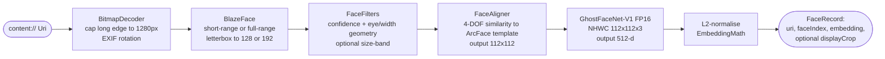

After `FaceProcessor` runs over every input image, the two flows diverge:

| Flow | Post-processor stage | Algorithm |
|------|----------------------|-----------|
| Clusterify | All embeddings → DBSCAN → centroids → DB | `Dbscan` over cosine distance |
| Filter    | Per-image embeddings vs N selected centroids | First-match cosine ≥ threshold |

The orchestrating use cases are `ClusterifyUseCase` and `FilterAgainstClustersUseCase`. Configuration that pins every threshold is centralised in `app/.../config/PipelineConfig.kt`.

---

## 1. Stage 0 — Runtime construction

Before any image work happens, the heavy graph (TFLite runtime + interpreters + use cases) is lazily built and cached by `MlPipelineProvider`. This is where the GPU-vs-CPU decision and the BlazeFace **short-range vs full-range** dispatch happen.

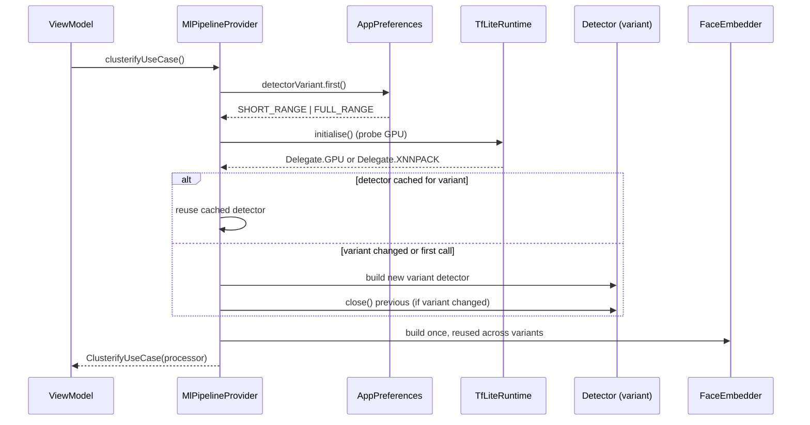

Key files:
- `app/.../ml/MlPipelineProvider.kt` — orchestrates lifetime + variant switch.
- `app/.../ml/TfLiteRuntime.kt` — Play-Services TFLite init, GPU probe, mmap model loader.

GPU/CPU choice is a one-time probe via `TfLiteGpu.isGpuDelegateAvailable`; on failure it falls back to XNNPACK with `PipelineConfig.Detector.interpreterThreads = 2`.

---

## 2. Stage 1 — Decode & downsample

File: `app/.../media/BitmapDecoder.kt`

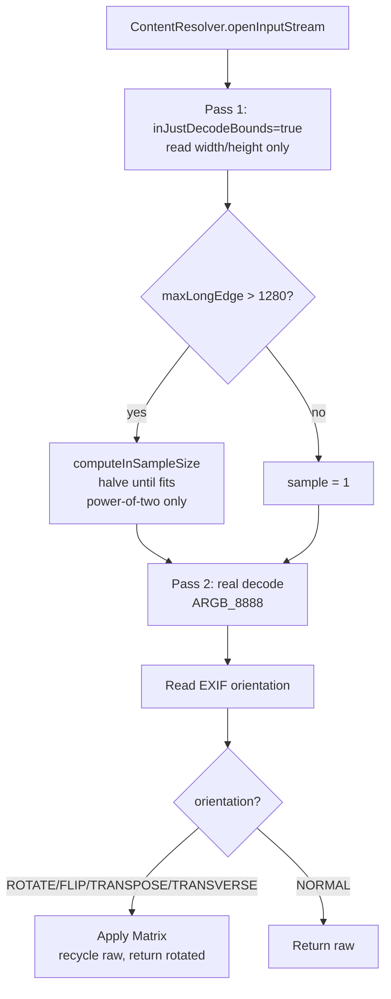

Why these choices:
- **Two-pass decode** — avoids loading a 24 MP photo into RAM only to throw most of it away.
- **Power-of-two sample size** — the only sample sizes Android `BitmapFactory` honours efficiently; halving the linear dim quarters the byte count.
- **1280 px cap** (`PipelineConfig.Decode.maxLongEdgePx`) — empirical floor that keeps phone-photo faces ≥80 px on the embedder input while staying inside SPEC NFR-04 memory budget.
- **EXIF rotation upfront** — every downstream stage assumes pixels are already in the visual orientation the user sees in Photos.

```kotlin
fun decode(resolver, uri, maxDim = 1280): Bitmap {
    val (w, h) = readBounds(resolver, uri)        // pass 1
    val sample = computeInSampleSize(w, h, maxDim) // 1, 2, 4, 8, ...
    val raw = decodeStream(resolver, uri, sample)  // pass 2
    return applyExifRotation(resolver, uri, raw)   // 90/180/270/flip/transpose
}
```

---

## 3. Stage 2 — Face detection (BlazeFace)

Two interchangeable detector variants; user picks one in Settings (default = `FULL_RANGE` since 2026-05-09).

| Variant | Input | Anchor grid | Anchors | Use case |
|---------|-------|-------------|---------|----------|
| Short-range | 128×128 | 16×16×2 + 8×8×6 | 896 | Selfie-distance frontal faces |
| Full-range  | 192×192 | 48×48×1        | 2304 | Group photos, distant/off-axis faces |

**Why two?** Empirical: on a 25-photo real-world set, `FULL_RANGE` recovered 32 faces vs `SHORT_RANGE`'s 15 with tighter same-person cosine distances (best 0.17 vs 0.23). Cost: +20% latency, +1.1 MB on disk.

The two paths share **only** the `FaceDetector` interface and the `DetectedFace` / `FaceLandmarks` data classes — anchor tables, decoders, regressor unpacking and TFLite output-tensor lookups are deliberately duplicated so a tweak to one cannot silently regress the other.

Files:
- `app/.../ml/BlazeFaceShortRangeDetector.kt` + `BlazeFaceShortRangeDecoder.kt` + `BlazeFaceShortRangeAnchors.kt`
- `app/.../ml/BlazeFaceFullRangeDetector.kt`  + `BlazeFaceFullRangeDecoder.kt`  + `BlazeFaceFullRangeAnchors.kt`

### 3.1 Pre-processing: letterbox + normalise

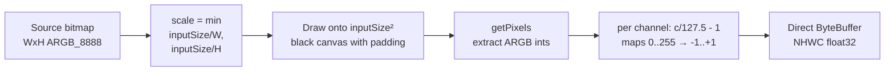

Pseudocode (shared shape across both variants; `BlazeFaceShortRangeDetector.prepareInput` is the canonical implementation):

```text
scale = min(input/W, input/H)
padX, padY = center the scaled image inside input × input
canvas = ARGB_8888(input, input)
canvas.drawBitmap(source, Matrix.scaleAndTranslate(scale, padX, padY))
for each pixel p in canvas:
    buffer.putFloat((R(p)/127.5) - 1)
    buffer.putFloat((G(p)/127.5) - 1)
    buffer.putFloat((B(p)/127.5) - 1)
```

A check at the end of `prepareInput` warns when channel variance < 0.05 — usually a blank/solid-colour input.

### 3.2 Inference

The interpreter has **two named outputs**: `regressors` (anchors × 16) and `classificators` (anchors × 1). Both detectors look these up by name (case-insensitive contains) so re-exports with shuffled output order still work.

```text
inputBuffer  : float32[1, input, input, 3]  (NHWC, [-1, 1])
regressors   : float32[1, A, 16]
classificators: float32[1, A, 1]            (raw logits, NOT sigmoid'd)
```

Where `A` = 896 (short) or 2304 (full).

### 3.3 Decode (per anchor)

For each anchor `i`:

```text
score = sigmoid(classifications[i])
if score < scoreThreshold (0.55): drop      // PipelineConfig.Detector.scoreThreshold
anchor center (cx, cy) is in [0,1]² (centre of grid cell)
box center, in input pixels:
    cx_px = (anchor.cx + reg[0]/inputSize) * inputSize
    cy_px = (anchor.cy + reg[1]/inputSize) * inputSize
box size, in input pixels:
    w = reg[2]; h = reg[3]
unproject to source pixels:
    sx = sourceWidth / inputSize; sy = sourceHeight / inputSize
    rect = (cx_px - w/2, cy_px - h/2, cx_px + w/2, cy_px + h/2) * (sx, sy)
landmarks: 6 (x, y) pairs at reg[4..15], same unprojection
```

The decoder also tracks the **distribution** of logits per call (min/mean/max, count > 0, top anchor index) — a key debugging hook in the FaceMesh log convention so you can replay the run from logcat.

Why `0.55`? Recovered group-photo recall: real-world distant faces peaked at sigmoid 0.55–0.70. Pre-2026-05-09 default was 0.75 and was silently dropping them.

### 3.4 Post-processing: weighted NMS

MediaPipe-style **weighted** non-max suppression (rather than hard suppression):

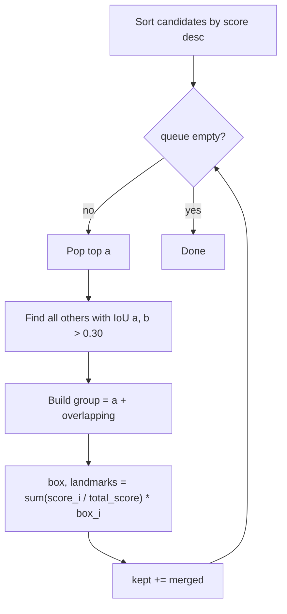

`PipelineConfig.Detector.nmsIouThreshold = 0.30`. Weighted averaging stabilises the bounding box when several anchors fire on the same face — a hard "keep top, drop rest" produces jitter that propagates into landmark positions and ultimately into alignment.

### 3.5 Output of the detector

A `List<DetectedFace>`, each carrying:
- `boundingBox: RectF` in source-pixel coordinates
- `landmarks: FaceLandmarks` (6 points: rightEye, leftEye, nose, mouth, rightEar, leftEar)
- `score: Float` ∈ [0, 1] (sigmoid'd)

---

## 4. Stage 3 — FaceFilters (post-detection heuristics)

File: `app/.../ml/FaceFilters.kt`

Cheap, deterministic culls that run **after NMS** and **before alignment** — saving the cost of alignment + a forward pass through the embedder for things that are obviously not faces.

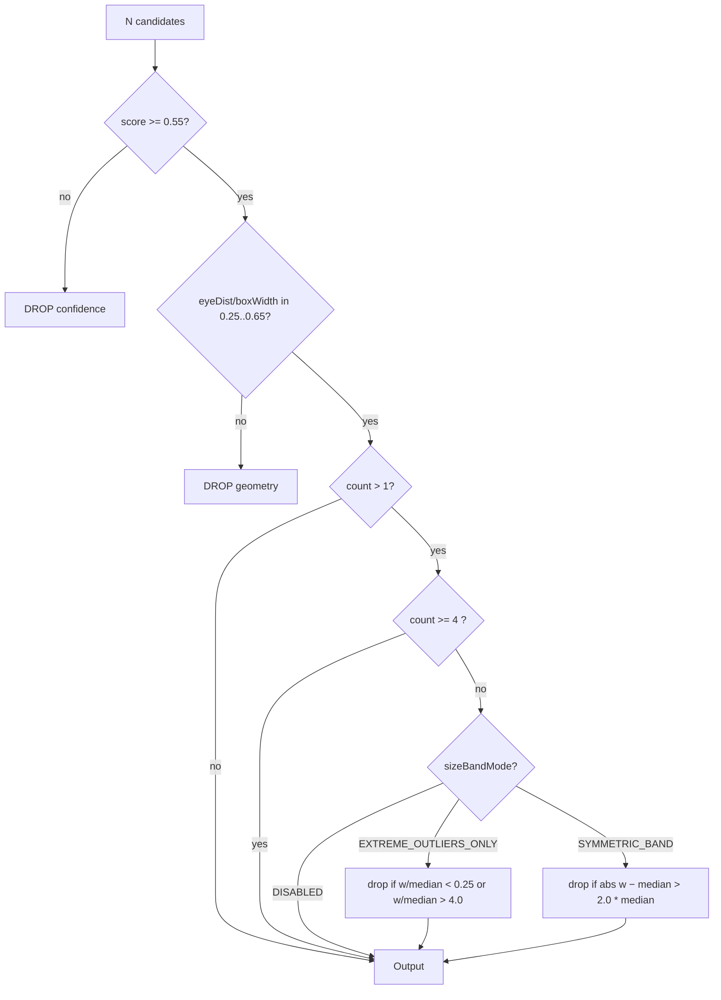

### 4.1 Stage 1 — Confidence floor

Re-applied at `PipelineConfig.Filters.confidenceThreshold = 0.55` (kept aligned with the decoder's threshold so this stage doesn't silently undo recall recovery).

### 4.2 Stage 2 — Geometric sanity (eye / width ratio)

For a real human face,

```text
ratio = eyeDistance(rightEye, leftEye) / boundingBox.width()
real faces cluster around ~0.40 (front-on), degrade gracefully toward 0.25 / 0.65 as the head turns
```

Rejecting `ratio ∉ [0.25, 0.65]` removes anchors that fire on shoulders/hands/textures with implausible "eye" landmarks.

### 4.3 Stage 3 — Size-outlier (currently DISABLED in production)

The size-band stage has a documented history: a strict symmetric `±median * fraction` cull was introduced for portrait/duo precision but became a regression for group photos containing both near and far subjects (the small face is `< median - band`, the close face is `> median + band`, both get dropped).

The current production setting is `SizeBandMode.DISABLED`. The other two modes are kept available (and tested) for diagnostic / experimental work:

| Mode | Drop rule | Where it shines | Where it breaks |
|------|-----------|-----------------|-----------------|
| `DISABLED` | — | Everywhere; trust DBSCAN to clean up later | Lets pathological anchor outliers through |
| `EXTREME_OUTLIERS_ONLY` | `width < 0.25*median or width > 4.0*median` | Catches absurd anchors only | Rare child-in-background false negatives |
| `SYMMETRIC_BAND` | `abs(width − median) > 2.0*median` | Tightest for 2-3-person frames | Group photos with mixed sizes |

All three modes **short-circuit** when `n ≥ groupPhotoSizeBandSkipThreshold = 4` — once you're in group-photo territory, the median ceases to be a useful "real face" anchor; let DBSCAN handle it.

---

## 5. Stage 4 — Face alignment

File: `app/.../ml/FaceAligner.kt`

The embedder, GhostFaceNet-V1, was trained on faces posed to a fixed 5-point ArcFace template at 112×112. We affinely warp every detected face into that pose before embedding.

### 5.1 Why a 4-DOF similarity, not an 8-DOF perspective?

The "obvious" Android API `Matrix.setPolyToPoly(src, dst, count = 4)` does an **8-DOF perspective fit** — it can match 4 source points to 4 destination points exactly, but with 4 DOF of slack to latch onto landmark-prediction noise. Real-world faces are well-modelled by a 2D similarity (uniform scale + rotation + translation, 4 DOF). Validation on the Virat / SRK test triplet via `tools/reference_embed.py`:

```
perspective fit:  same-person cosine ≈ 0.25   (visibly distorted "kaleidoscope" crops)
similarity fit:   same-person cosine ≈ 0.67   (tight, ArcFace-canonical pose)
```

So we solve a **least-squares similarity** instead, which matches InsightFace's `cv2.estimateAffinePartial2D`.

### 5.2 The math

Source: 4 detected landmarks (rightEye, leftEye, nose, mouthCenter).
Destination: ArcFace canonical at 112×112 (`PipelineConfig.Aligner.canonicalLandmarkTemplate`).

Model:

```
dx = a*sx − b*sy + tx
dy = b*sx + a*sy + ty
```

where `(a, b) = scale * (cos θ, sin θ)`. Each (sx, sy) → (dx, dy) pair contributes 2 equations:

```
[ sx   −sy   1   0 ] [ a  ]   [ dx ]
[ sy    sx   0   1 ] [ b  ] = [ dy ]
                     [ tx ]
                     [ ty ]
```

For 4 landmarks we get 8 equations in 4 unknowns — over-determined. Form the 4×4 normal equations `AᵀA x = Aᵀb`, solve with Gaussian elimination + partial pivoting (`solve4x4Gaussian`). Pivot < 1e-12 throws "singular" — caught and reported via `Log.w`, alignment then proceeds with the identity matrix (defensive but visible in the diagnostic log).

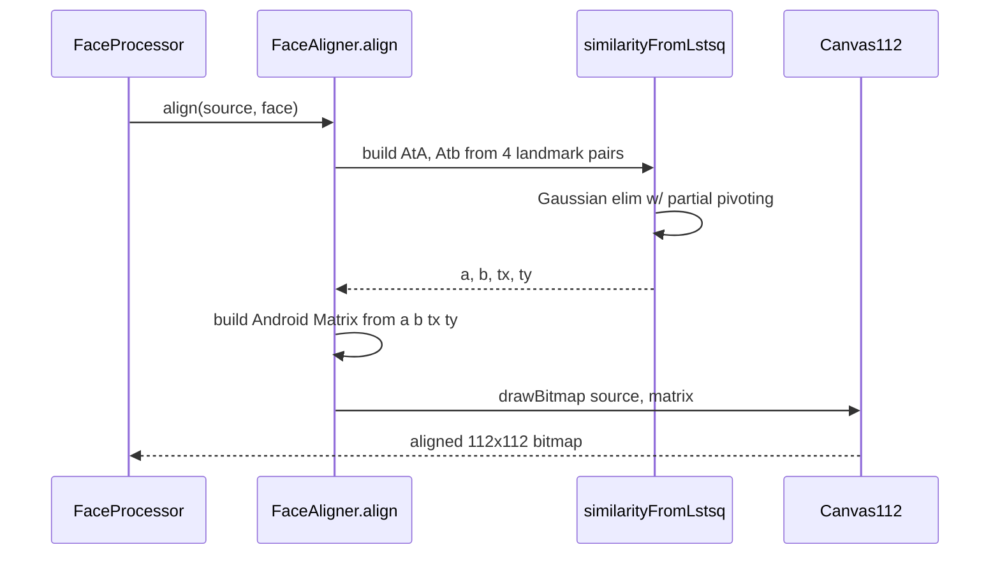

Diagnostic log emits `scale = sqrt(a² + b²)` and `rotation = atan2(b, a) deg` — useful sanity check; for a face at ≥ 80 px eye distance, `scale ≈ 0.05..0.4` and `|rotation| < 30°`.

---

## 6. Stage 5 — Embedding (GhostFaceNet-V1 FP16)

File: `app/.../ml/FaceEmbedder.kt`

| Property | Value |
|----------|-------|
| Architecture | GhostFaceNet-V1 (`ghostface_fp16.tflite`, FP16 quant) |
| Input | float32 NHWC `[1, 112, 112, 3]`, normalised to [-1, 1] |
| Output | float32 `[1, 512]` |
| Reference | https://github.com/alifesoftware/ModelZoo/blob/master/GhostFaceNet/Model/ghostface_fp32.onnx |

### 6.1 Pre-processing

Same per-channel `c / 127.5 - 1` normalisation as the detector. Bitmap is read into a reusable `IntArray`, unpacked into the reusable direct `ByteBuffer` (no per-call allocation in steady state).

### 6.2 Post-processing

```text
embedding = interpreter.run(input)[0]   // length 512
copy = embedding.copyOf()                // caller-owned
EmbeddingMath.l2NormalizeInPlace(copy)
return copy
```

L2 normalisation makes the dot product equal cosine similarity for downstream code. `EmbeddingMath` (file: `app/.../ml/cluster/EmbeddingMath.kt`) handles a corner case: vectors with `norm < 1e-8` (dead-output noise) are zero-filled instead of dividing by zero, producing benign (and detectable) zeros downstream.

### 6.3 What "FP16" buys us

Half-precision weights cut the model file from ~14 MB (FP32) to ~7 MB at no measurable accuracy loss for face-id tasks. Inference still runs in FP32 on most delegates but with FP16 weights stored — a Pareto-friendly compression for an Android sidecar download.

---

## 7. Stage 6a — Clusterify: DBSCAN over cosine distance

File: `app/.../ml/cluster/Dbscan.kt`, orchestrated by `app/.../domain/ClusterifyUseCase.kt`.

### 7.1 Why DBSCAN, not k-means?

| Property | DBSCAN | k-means |
|----------|--------|---------|
| Need to know `k` upfront? | No | Yes |
| Handles "stranger" outliers? | Yes (NOISE label) | No (forces every point into a cluster) |
| Cluster shape | Density-based, arbitrary | Spherical only |
| Distance metric | Pluggable (we use cosine) | L2 by default |

Group photos contain people the user did **not** intend to cluster. DBSCAN's noise label (`-1`) lets these drop out cleanly; k-means would assign them to the nearest centroid and pollute clusters.

### 7.2 Parameters

| Parameter | Default | Range | Source priority |
|-----------|---------|-------|-----------------|
| `eps` (max cosine distance for neighbour) | 0.35 | 0.10 – 0.80 | user override > manifest > config |
| `minPts` (min neighbours incl. self for core) | 2    | 1 – 10      | manifest > config (no user slider) |

`eps = 0.35` is the empirical sweet spot on GhostFaceNet 512-d L2-normed embeddings.

`minPts = 2` is the lowest useful value: any two faces above the eps similarity threshold form a cluster — matches the small-library v1 UX (one duplicate of a person is enough to surface them).

### 7.3 Algorithm

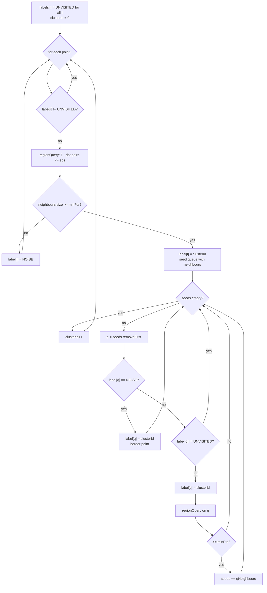

Pseudocode (faithful to the implementation):

```text
labels = [UNVISITED] * n
for i in 0..n:
    if labels[i] != UNVISITED: continue
    N = regionQuery(i)                 // |1 - a.b| <= eps
    if |N| < minPts:
        labels[i] = NOISE
        continue
    labels[i] = clusterId
    seeds = N
    while seeds:
        q = seeds.popFront()
        if labels[q] == NOISE: labels[q] = clusterId   // border promotion
        if labels[q] != UNVISITED: continue
        labels[q] = clusterId
        if |regionQuery(q)| >= minPts:
            seeds += regionQuery(q)
    clusterId++
```

Complexity: **O(n²)** because `regionQuery` is a linear scan over every point. With n typically ≤ a few hundred faces in a single Clusterify run, this is fine; an index (KD-tree, ball tree) is unnecessary at this scale.

### 7.4 ClusterifyUseCase orchestration

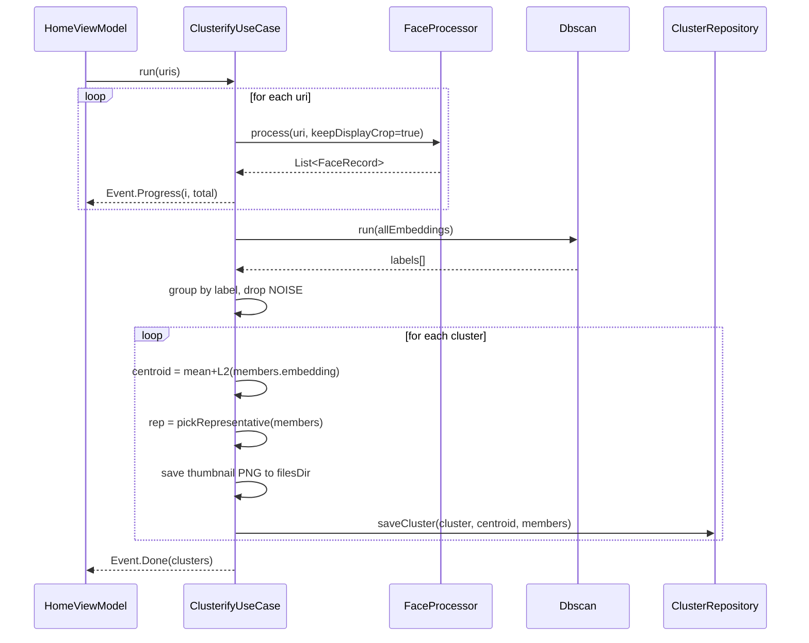

`pickRepresentative` chooses the member with the largest natural display crop (largest face = closest to camera = most recognisable thumbnail). The centroid is `meanAndNormalize` over the cluster's L2-normed embeddings — already-unit vectors averaged then re-normalised, which is a cheap proxy for the geodesic mean on the unit sphere.

---

## 8. Stage 6b — Filter: per-image cosine vs centroids

File: `app/.../domain/FilterAgainstClustersUseCase.kt`

Phase 2 is conceptually simpler: each candidate image is processed exactly like Clusterify (without `keepDisplayCrop`); each face's embedding is dotted against every selected centroid; the image is a Keeper if **any** face beats the threshold against **any** centroid.

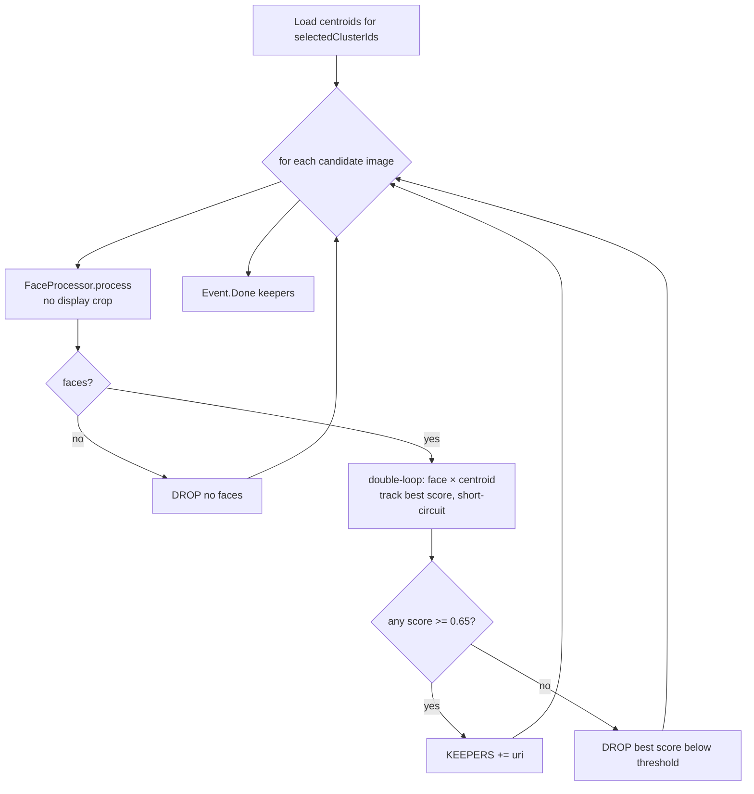

Pseudocode:

```text
for image in candidates:
    faces = processor.process(image)
    if faces.empty(): continue
    bestScore = -inf
    found = false
    for f in faces:                    // outer loop short-circuits on first hit
        for c in centroids:
            score = dot(f.embedding, c)   // cosine, both already L2-normed
            track bestScore
            if score >= matchThreshold:
                found = true; break (outer)
    if found: keepers += image
    else: drop (with bestScore in the log)
```

Threshold: `PipelineConfig.Match.defaultThreshold = 0.65`. GhostFaceNet "same person" similarity typically lives in 0.55–0.85; 0.65 picks up most pose variance without leaking look-alikes.

The inner loop logs **every** `face × centroid` pair score, plus a `KEEP via face[i] × centroid[j]` or `DROP bestScore=...` per image. This is intentional: the most common debugging question for a Filter run is "why was this photo dropped?" — the log answers it without having to re-run.

---

## 9. Models — registry and dispatch

The three shipped TFLite models live as a sidecar bundle, downloaded on first launch and verified by SHA-256 against `models/manifest.json` (mirrored in the project repo):

```json
{
  "version": 2,
  "models": [
    { "type": "detector_blazeface_short_range", "name": "face_detection_short_range.tflite", ... },
    { "type": "detector_blazeface_full_range",  "name": "face_detection_full_range.tflite",  ... },
    { "type": "embedder_ghostfacenet_fp16",     "name": "ghostface_fp16.tflite",             ... }
  ],
  "config": {
    "dbscan_eps": 0.35,
    "dbscan_min_pts": 2,
    "match_threshold": 0.65,
    "detector_short_range_input": [128, 128],
    "detector_full_range_input":  [192, 192],
    "embedder_input":             [112, 112]
  }
}
```

| Role | Architecture | File | In | Out |
|------|--------------|------|-----|-----|
| Detector (selfie) | BlazeFace short-range | `face_detection_short_range.tflite` | `[1,128,128,3]` f32 [-1,1] | `regressors[1,896,16]`, `classificators[1,896,1]` |
| Detector (group)  | BlazeFace full-range  | `face_detection_full_range.tflite`  | `[1,192,192,3]` f32 [-1,1] | `regressors[1,2304,16]`, `classificators[1,2304,1]` |
| Embedder | GhostFaceNet-V1 FP16 | `ghostface_fp16.tflite` | `[1,112,112,3]` f32 [-1,1] | `[1,512]` |

Manifest parsing (`app/.../ml/download/ModelManifest.kt`) is **schema-tolerant** — old v1 manifests with a single `detector_input` key still parse, with `full_range` defaulting to 192×192. New writes always emit v2.

Download manager: `app/.../ml/download/ModelDownloadManager.kt` — pure-Kotlin/JDK (no OkHttp/Retrofit, to stay inside APK budget), atomic temp-file + rename, SHA-256 verify per file, 3 retries with 1s/4s/16s backoff.

---

## 10. Configuration matrix

Every "knob" lives in one place: `app/.../config/PipelineConfig.kt`. Each property is annotated with one of three classes:

| Class | Meaning | Examples |
|-------|---------|----------|
| **MODEL CONTRACT** | Locked to the on-disk model. Changing without re-export breaks inference. | `inputSize`, `numAnchors`, `regStride`, `embeddingDim`, `canonicalLandmarkTemplate` |
| **TUNABLE HEURISTIC** | Compile-time default; engineer adjusts when chasing recall vs. precision. | `scoreThreshold`, `nmsIouThreshold`, `eyeWidthRatioMin/Max`, `paddingFraction` |
| **USER SETTING DEFAULT** | Default for a value the user can override at runtime via `AppPreferences`. | `defaultEps`, `defaultMinPts`, `defaultThreshold`, `defaultVariant` |

### 10.1 The user-overridable knobs

Resolved with a 3-layer priority `USER > MANIFEST > DEFAULT`:

```
read time:
  if prefs[KEY_xxx_USER_OVERRIDE] is set: use that      (Source.USER)
  elif prefs[KEY_xxx] is set:             use that      (Source.MANIFEST)
  else:                                   PipelineConfig (Source.DEFAULT)
```

The `Source` is logged on every Clusterify / Filter run so the diagnostic log states **why** a value was used.

### 10.2 Cheat sheet

| Knob | Default | Where set | Effect of lower | Effect of higher |
|------|---------|-----------|-----------------|------------------|
| `Decode.maxLongEdgePx` | 1280 | Compile-time | Faster, less RAM, smaller faces | Sharper embeddings on small faces, slower |
| `Detector.scoreThreshold` | 0.55 | Compile-time | More recall, more false positives | Sharper precision, distant faces lost |
| `Detector.nmsIouThreshold` | 0.30 | Compile-time | Fewer duplicates, side-by-side may merge | Tolerates near-overlap, stacked dupes possible |
| `Detector.defaultVariant` | `FULL_RANGE` | User pref | `SHORT_RANGE` faster on selfies | `FULL_RANGE` recall on group/distant |
| `Filters.confidenceThreshold` | 0.55 | Compile-time | Same as `Detector.scoreThreshold`, kept aligned | Same |
| `Filters.eyeWidthRatioMin/Max` | 0.25 / 0.65 | Compile-time | Accepts more profile faces | Front-facing only |
| `Filters.sizeBandMode` | `DISABLED` | Compile-time | EXTREME_OUTLIERS_ONLY: defensive | SYMMETRIC_BAND: tightest precision (group regression) |
| `Filters.groupPhotoSizeBandSkipThreshold` | 4 | Compile-time | Skip on smaller groups | Apply on bigger groups |
| `Aligner.outputSize` | 112 | Model contract | — | — |
| `Aligner.canonicalLandmarkTemplate` | ArcFace 4-pt | Model contract | — | — |
| `Embedder.inputSize` | 112 | Model contract | — | — |
| `Embedder.embeddingDim` | 512 | Model contract | — | — |
| `DisplayCrop.paddingFraction` | 0.30 | Compile-time | Tighter avatar | Roomier with more context |
| `DisplayCrop.maxOutputDim` | 256 | Compile-time | Smaller PNG, aliasing on HDPI | Crisper, more storage |
| `Clustering.defaultEps` | 0.35 | User pref | Tighter clusters, more splits | Looser clusters, more merges |
| `Clustering.defaultMinPts` | 2 | Manifest/config | minPts=1 trivialises DBSCAN | Single-photo people drop as noise |
| `Match.defaultThreshold` | 0.65 | User pref | More keepers (recall ↑, precision ↓) | Fewer keepers (precision ↑, recall ↓) |

---

## 11. Threading & memory model

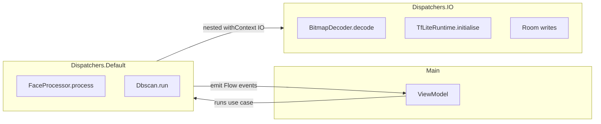

- `FaceProcessor.process` runs on `Dispatchers.Default` (CPU-bound), with a nested `withContext(IO)` for the bitmap decode (disk + network for content URIs).
- `Dbscan.run` runs on `Default` via the surrounding Flow's `flowOn`.
- Reusable buffers in `BlazeFace*Detector` and `FaceEmbedder` (direct `ByteBuffer`s, output arrays, `Paint`, `Matrix`) keep allocations out of the hot path; safe because each detector/embedder instance is used by at most one coroutine at a time (the `ensureProcessor` flow guarantees a single active `FaceProcessor`).
- Bitmap discipline: source bitmap recycled in `finally`; aligned 112×112 bitmap recycled immediately after embedding; display crop is the only bitmap that escapes `process`, and it's *forced to be a defensive copy* when `Bitmap.createBitmap` would have aliased the source.

---

## 12. Persistence

After Clusterify, each cluster is persisted via `ClusterRepository.saveCluster`:

| Table | Row | Notes |
|-------|-----|-------|
| `cluster` | `(id, centroid, representativeImageUri, faceCount, createdAt, name?)` | `centroid` is a 512-float blob via `FloatArrayConverter`; `representativeImageUri` points to a PNG saved in `filesDir/representatives/<uuid>.png` |
| `cluster_image` | `(clusterId, imageUri, faceIndex, embedding)` PK composite | `embedding` is a 512-float blob; composite PK lets one source image contribute multiple faces (group shots) to same / different clusters |

Filter doesn't write — it reads centroids only.

---

## 13. End-to-end sequence diagrams

### 13.1 Clusterify

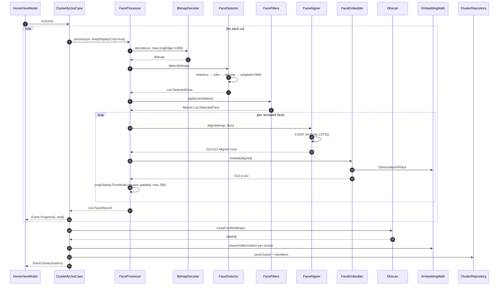

### 13.2 Filter

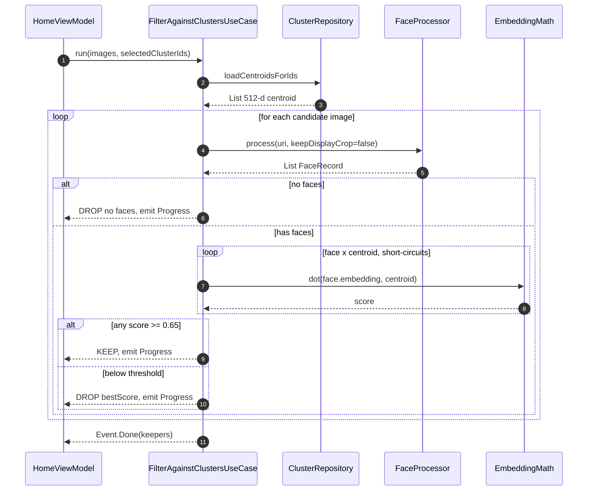

---

## 14. Quick reference — files

| Concern | File |
|---------|------|
| Configuration (single source of truth) | `app/src/main/kotlin/com/alifesoftware/facemesh/config/PipelineConfig.kt` |
| Decode | `…/media/BitmapDecoder.kt` |
| Detector interface + DTOs | `…/ml/FaceDetector.kt`, `…/ml/DetectedFace.kt` |
| Detector — short-range | `…/ml/BlazeFaceShortRangeDetector.kt`, `…/Decoder.kt`, `…/Anchors.kt` |
| Detector — full-range | `…/ml/BlazeFaceFullRangeDetector.kt`, `…/Decoder.kt`, `…/Anchors.kt` |
| Filters | `…/ml/FaceFilters.kt` |
| Aligner | `…/ml/FaceAligner.kt` |
| Embedder | `…/ml/FaceEmbedder.kt` |
| Vector math | `…/ml/cluster/EmbeddingMath.kt` |
| DBSCAN | `…/ml/cluster/Dbscan.kt` |
| Per-image pipeline | `…/ml/FaceProcessor.kt` |
| Lifecycle / DI | `…/ml/MlPipelineProvider.kt`, `…/ml/TfLiteRuntime.kt` |
| Use cases | `…/domain/ClusterifyUseCase.kt`, `…/domain/FilterAgainstClustersUseCase.kt` |
| Persistence | `…/data/Entities.kt`, `…/data/ClusterRepository.kt`, `…/data/AppPreferences.kt` |
| Manifest / download | `…/ml/download/ModelManifest.kt`, `…/ml/download/ModelDownloadManager.kt` |
| Manifest (on-disk) | `models/manifest.json` |

---

## 15. Mental model — one sentence per stage

1. **Decode** — turn a `content://` Uri into an EXIF-correct, ≤1280 px ARGB bitmap.
2. **Detect** — letterbox to BlazeFace input, run inference, decode anchor offsets, weighted-NMS overlapping boxes.
3. **Filter** — drop low-confidence, non-human-geometry, and (optionally) wildly-sized boxes before paying for alignment + embedding.
4. **Align** — least-squares similarity warp to ArcFace canonical 112×112, the pose GhostFaceNet was trained on.
5. **Embed** — GhostFaceNet-V1 FP16 → 512-d vector → L2-normalise so dot product == cosine similarity.
6. **Cluster** (Clusterify) — DBSCAN with eps=0.35, minPts=2 over cosine distance; centroid = L2-normed mean.
7. **Match** (Filter) — image is a Keeper iff any face's dot product with any selected centroid ≥ 0.65.
